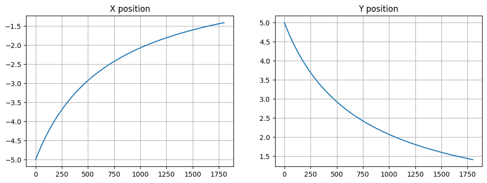
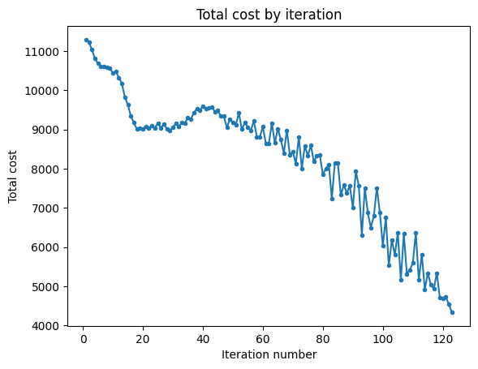
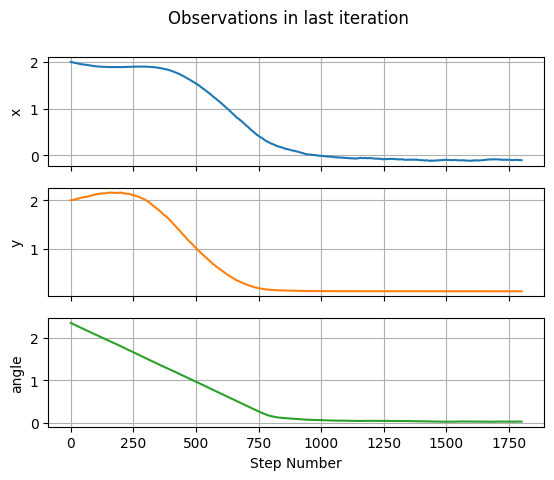
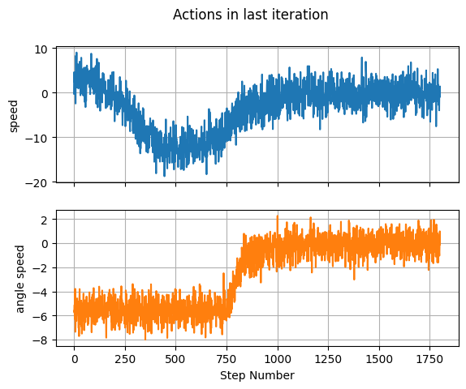

Three wheeled robot: problem description
========================================

$ %%%%PREAMBLE%%%%%% %%%%%%%%%%%%%%%%%%%%%%%%%%%%%%%%%%%%%%%%%%%%%%%%%%
Arrow notation :raw-latex:`\newcommand{\ra}{\rightarrow}`
:raw-latex:`\newcommand{\rra}{\rightrightarrows}`
:raw-latex:`\newcommand{\la}{\leftarrow}` %

.. raw:: latex

   \newcommand{\red}[1]{\textcolor{red}{#1}}

%%%%%%%%%%%%%%%%%%%%%%%%%%%%%%%%%%%%%%%%%%%%%%%%%% Abbreviations
:raw-latex:`\newcommand{\ie}{\unskip, i.\,e.,\xspace}`
:raw-latex:`\newcommand{\eg}{\unskip, e.\,g.,\xspace}`
:raw-latex:`\newcommand{\pd}{p.\,d.\xspace}`
:raw-latex:`\newcommand{\sut}{\text{s.\,t.\,}}`
:raw-latex:`\newcommand{\rt}{r.\,t.\xspace}`
%%%%%%%%%%%%%%%%%%%%%%%%%%%%%%%%%%%%%%%%%%%%%%%%%% Wraps

.. raw:: latex

   \newcommand{\nrm}[1]{\left\lVert#1\right\rVert}
   \newcommand{\diag}[1]{{\text{diag}}\left(#1\right)}
   \newcommand{\abs}[1]{\left\lvert#1\right\rvert}
   \newcommand{\scal}[1]{\left\langle#1\right\rangle}
   \newcommand{\tr}[1]{{\text{tr}}\left(#1\right)}
   \newcommand{\E}[1]{\mathbb E\left[#1\right]}
   \newcommand{\PP}[1]{\mathbb P\left[#1\right]}

%%%%%%%%%%%%%%%%%%%%%%%%%%%%%%%%%%%%%%%%%%%%%%%%%% Set notation
:raw-latex:`\renewcommand{\N}{{\mathbb{N}}}`
:raw-latex:`\renewcommand{\Z}{{\mathbb{Z}}}`
:raw-latex:`\newcommand{\Q}{{\mathbb{Q}}}`
:raw-latex:`\renewcommand{\R}{{\mathbb{R}}}`
:raw-latex:`\newcommand{\T}{{\mathbb{T}}}`
:raw-latex:`\newcommand{\X}{{\mathbb{X}}}`
:raw-latex:`\newcommand{\Y}{{\mathbb{Y}}}`
:raw-latex:`\newcommand{\F}{{\mathbb{F}}}`
:raw-latex:`\newcommand{\U}{{\mathbb{U}}}` %

.. raw:: latex

   \renewcommand{\U}{{\mathbb{U}}}
   \newcommand{\sm}{{\setminus}}
   \renewcommand{\set}[1]{{\mathbb{#1}}}

%

.. raw:: latex

   \let\oldemptyset\emptyset

%

.. raw:: latex

   \let\emptyset\varnothing

%%%%%%%%%%%%%%%%%%%%%%%%%%%%%%%%%%%%%%%%%%%%%%%%%% Colored %

.. raw:: latex

   \newcommand{\red}[1]{\textcolor{red}{#1}}

%

.. raw:: latex

   \newcommand{\blue}[1]{\textcolor{blue}{#1}}

% :raw-latex:`\definecolor{dgreen}{rgb}{0.0, 0.5, 0.0}` %

.. raw:: latex

   \newcommand{\green}[1]{\textcolor{dgreen}{#1}}

%%%%%%%%%%%%%%%%%%%%%%%%%%%%%%%%%%%%%%%%%%%%%%%%%% Miscellaneous
commands :raw-latex:`\newcommand{\diff}{\mathop{}\!\mathrm{d}}`
:raw-latex:`\newcommand{\eps}{{\varepsilon}}`
:raw-latex:`\newcommand{\sgn}{{\text{sgn}}}`
:raw-latex:`\newcommand{\spc}{{\,\,}}`
:raw-latex:`\newcommand{\diam}{{\text{diam}}}`
:raw-latex:`\newcommand{\dom}{{\text{dom}}}`
:raw-latex:`\newcommand{\ramp}{{\text{ramp}}}`

.. raw:: latex

   \newcommand{\pdiff}[2]{ { \frac{\partial {#1}}{\partial {#2}} } }
   \newcommand{\ball}{{\mathcal B}}

%

.. raw:: latex

   \newcommand\circled[1]{\tikz[baseline=(char.base)]{\node[shape=circle,draw,inner sep=1pt](char){#1};}}
   \newcommand{\co}{{\overline{\text{co}}}}

% :raw-latex:`\newcommand{\argmin}{\arg\min}` %
:raw-latex:`\newcommand{\argmax}{arg\,max}`
:raw-latex:`\newcommand{\lineZ}{\overline{Z}}`
:raw-latex:`\newcommand{\lineR}{\overline{R}}`
:raw-latex:`\newcommand{\linez}{\overline{z}}`

.. raw:: latex

   \newcommand{\EP}[2]{\mathbb E_{#1}\left[#2\right]}

$

Here we consider a learning control for three wheeled robot described
by:

.. math::

       \begin{aligned}
           &  \dot{x}_{\text{rob}} = v \cos(\vartheta), \\
           &  \dot{y}_{\text{rob}} = v \sin(\vartheta), \\
           & \dot{\vartheta} = \omega.
       \end{aligned}
       \qquad v \in [v_{\min}, v_{\max}], \quad \omega \in [\omega_{\min}, \omega_{\max}]

where robot speed :math:`v` and anglular speed :math:`\omega` are
control variables. We assume the starting position of robot is as
follows:

.. math::

       \begin{aligned}
           & {x}_{\text{rob}}(0) = 2 \\
           & {y}_{\text{rob}}(0) = 2 \\
           & \vartheta(0) = \frac{3\pi}{4}
       \end{aligned}    

The formal goal of control reads:

.. math::

       {x}_{\text{rob}} \ra 0 \qquad  {y}_{\text{rob}}  \ra 0 \qquad \vartheta \ra 0

We will try to achieve this using a stochastic control policy defined by
a model
:math:`\rho^\theta(v, \omega| {x}_{\text{rob}}, {y}_{\text{rob}}, \vartheta )`
with weights :math:`\theta` conditioned on the current *state*
:math:`({x}_{\text{rob}}, {y}_{\text{rob}}, \vartheta)` while optimizing
some running cost :math:`r` which we will diccuss later. We will treat
this :math:`\rho^\theta` as a probability distribution and will sample
the controls (actions) :math:`u=(v, \omega)` from :math:`\rho^\theta`.
Where necessary, we will stress the randomness of actions by capital
letters like :math:`U`.

There are many traditional control methods to achieve the state goal,
including those based on the model. In this notebook, we will pursue a
different route: we will learn from pure experience by repeatedly
running the pendulum and adjusting the model weights :math:`\theta`.

To assess the performance of our learned policy, we will penalize it by
a running cost function as follows:

.. math::

   r({x}_{\text{rob}}, {y}_{\text{rob}}, \vartheta, v, \omega) = {x}_{\text{rob}}^2 + {y}_{\text{rob}}^2 +  \vartheta^2

**Remark 1**

In reward maximization problems, :math:`r` is called a reward, rather
than cost. However, in this notebook we denote :math:`r` as cost
function. This changes almost nothing for us, because one can easily
transform any reward function :math:`r` to the cost function via putting
:math:`r := -r` and vice versa.

**Remark 2**

In general :math:`r(\cdot)` can depend on :math:`u = (v, \omega)`, but
in our case we do not put cost on action :math:`u`.

Environment
-----------

Consider a system

.. math::

       X_{k + 1} \sim f(x_{k+1} \mid x_k, u_k), \quad Y_k = h(X_k), \quad U_{k} \sim \rho^{\theta}(u_{k} \mid y_k).

We treat :math:`x_k` as a state
(i.e. :math:`({x}_{\text{rob}}, {y}_{\text{rob}}, \vartheta)` on step
:math:`k`) and :math:`y_k` as observation. If the observation function
is trivial (an identity), we can just consider:

.. math::

       Y_{k+1} \sim f(y_{k+1} \mid y_k, u_k), \quad U_{k} \sim \rho^{\theta}(u_{k} \mid y_k).

We will thus refer to :math:`y` as observation and state interchangeably
since they are identical.

The goal is to solve the following optimal control problem

.. math::

       \min_{\theta} J(\theta) = \EP{f,\rho^\theta}{\sum_{k = 0}^{\infty} \gamma^k r(Y_k, U_k)}

over policy weights :math:`\theta`. Here, :math:`\gamma` is the
*discount factor*.

Policy
------

The policy model will be taken as

.. math::

   \rho^{\theta}(v,\omega \mid {x}_{\text{rob}}, {y}_{\text{rob}}, \vartheta )= \mathsf{pdf}_{\mathcal{N}\left(\Lambda \mu^{\theta}(y) + \beta, \sigma^2 \Lambda^2\right)}(u) = \mathsf{pdf}_{\mathcal{N}\left(\mu^{\theta}(y), \sigma^2 I\right)}\left(\Lambda^{-1}(u - \beta)\right)

where 1. :math:`u = (v, \omega)` and
:math:`y = ({x}_{\text{rob}}, {y}_{\text{rob}}, \vartheta)` 2. $
:raw-latex:`\mathsf{pdf}`\_{:raw-latex:`\mathcal{N}`(:raw-latex:`\bullet`\_1,
:raw-latex:`\bullet`\_2)} $ refers to the normal probability density
with mean :math:`\bullet_1` and covariance matrix :math:`\bullet_2`

3. :math:`I` is :math:`2\times2` identity matrix:

   .. math::

       I = \begin{pmatrix} 1 & 0 \\ 0 & 1 \end{pmatrix}   

4. :math:`\beta \in \R^2` and

   .. math::

          
       \beta = \begin{pmatrix}\frac{v_{\min} + v_{\max}}{2} \\ \frac{\omega_{\min} + \omega_{\max}}{2}\end{pmatrix}

5. :math:`\Lambda \in \R^{2\times2}` is a diagonal matrix
   :math:`\Lambda = \operatorname{diag}(\lambda)`, where

   .. math::

       \lambda = \begin{pmatrix}\frac{v_{\max} - v_{\min}}{2}  \\  \frac{\omega_{\max} - \omega_{\min}}{2}\end{pmatrix}
       \quad \Longrightarrow \quad
       \Lambda  = \operatorname{diag}(\lambda) = \begin{pmatrix}\frac{v_{\max} - v_{\min}}{2} & 0 \\ 0 & \frac{\omega_{\max} - \omega_{\min}}{2}\end{pmatrix}

6. :math:`\mu^{\theta}(\cdot)` is a neural network with weights
   :math:`\theta` that consists of 2 parallel perceptrons:

   .. math::

       y \ra
       \begin{pmatrix}
       \text{Linear(3, 16)} \ra \text{LeakyReLU(0.2)} \ra \text{Linear(16, 16)} \ra \text{LeakyReLU(0.2)} \ra \text{Linear(16, 1)} \ra (1 - 3\sigma) \tanh\left(\frac{\cdot}{L}\right) \\
       \text{Linear(3, 16)} \ra \text{LeakyReLU(0.2)} \ra \text{Linear(16, 16)} \ra \text{LeakyReLU(0.2)} \ra \text{Linear(16, 1)} \ra (1 - 3\sigma) \tanh\left(\frac{\cdot}{L}\right)
       \end{pmatrix}

7. :math:`\sigma ^ 2 \in \R` is a hyperparameter ##### Remarks

-  Hyperparameter :math:`L` is merely a tuning parameter and does not
   posess a physical meaning
-  Note that on every step generated action :math:`U` is a random
   variable that is distributed as
   :math:`U \sim \Lambda \mathcal{N}\left(\mu^{\theta}(y), \sigma^2 I\right) + \beta = \mathcal{N}\left(\Lambda \mu^{\theta}(y) + \beta, \sigma^2 \Lambda^2\right)`
-  The fact that
   :math:`\mathsf{pdf}_{\mathcal{N}\left(\Lambda \mu^{\theta}(y) + \beta, \sigma^2 \Lambda^2\right)}(u) = \mathsf{pdf}_{\mathcal{N}\left(\mu^{\theta}(y), \sigma^2 I\right)}\left(\Lambda^{-1}(u - \beta)\right)`
   is true due to
   :math:`\Lambda \mathcal{N}(\mu^{\theta}(y), \sigma^2I) + \beta = \mathcal{N}\left(\Lambda \mu^{\theta}(y) + \beta, \sigma^2 \Lambda^2\right)`
-  Note that :math:`\Lambda^{-1}(u - \beta) \in [-1, 1] ^ 2` for
   :math:`u \in [v_{\min}, v_{\max}] \times [\omega_{\min}, \omega_{\max}]`.
   By construction, it holds that
   :math:`\mu^{\theta}(y) \in [-1 + 3\sigma, 1 - 3\sigma] ^ 2`. Thus,
   the policy :math:`\rho^{\theta}` samples actions that are within
   action bounds
   :math:`[v_{\min}, v_{\max}] \times [\omega_{\min}, \omega_{\max}]`
   with propability greater than 99.86% by
   :math:`3\sigma`-`rule <https://en.wikipedia.org/wiki/68%E2%80%9395%E2%80%9399.7_rule>`__.
   This slight imprecision has no effect on efficiency. See the picture
   below for details.

Critic
------

In reinforcement learning algorithms critic is used for helping the
policy (a.k.a. actor) to stabilize the system. This goal is achieved via
running consequent optimization procedures for critic and policy. Thus,
critic and policy are two entities that take turns in helping each other
to achieve a common goal.

Critic model will be taken as perceptron :math:`\hat{J}^{w}(y)` with
weights :math:`w` which approximates the so-called cost-to-go
:math:`J^{\rho^{\theta}}(y)`, i.e. the function that equals the expected
value of discounted sum of infinite number costs with :math:`y` taken as
intitial observation with further applying of the policy
:math:`\rho^{\theta}` for infinite number of times. Strictly speaking,

.. math::

        J^{\rho^{\theta}}(y) = \EP{f, \rho^{\theta}}{\sum_{k = 0}^{\infty} \gamma ^ k r(Y_k, U_k) \mid Y_0 = y},

where :math:`\gamma \in [0,1]` is a *discount factor* and should be
interpreted as hyperparameter of algorithm.

Proximal Policy Optimization algorithm
--------------------------------------

General formula (you can find inference `below <#theory>`__):

.. math::

     \boxed{
       \begin{array}{l}
       \hphantom{~}
       \\
       \theta_{i+1} \la \arg\min_{\theta}\EP{f, \rho^{\theta_i}}{\sum_{k=0}^{\infty} \gamma ^ k \max\left(A^{\rho^{\theta_i}}(Y_k, U_k)   \frac{\rho^{\theta}(U_k \mid Y_k)}{\rho^{\theta_i}(U_k \mid Y_k)}, A^{\rho^{\theta_i}}(Y_k, U_k) \operatorname{clip}_{1 - \varepsilon}^{1 + \varepsilon}\left(\frac{\rho^{\theta}(U_k \mid Y_k)}{\rho^{\theta_i}(U_k \mid Y_k)}\right) \right)}
       \\
       \hphantom{~}
       \end{array}
     },

where $A\ :sup:`{:raw-latex:`\rho``\ {:raw-latex:`\theta`\_i}}(Y_k, U_k)
= r(Y_k, U_k) +
:raw-latex:`\gamma `J\ :sup:`{:raw-latex:`\rho``\ {:raw-latex:`\theta`\ *i}}(Y*\ {k+1})
- J\ :sup:`{:raw-latex:`\rho``\ {:raw-latex:`\theta`\ *i}}(Y*\ {k}) $.
On practice the number of steps :math:`k` is finite and we denote it by
:math:`N`. The detailed description of algorithm is as follows (note
that it works only for :math:`\gamma < 1`).

   **for** :math:`i` in :math:`\{1, \dots, \mathcal I\}`:
   (:math:`\mathcal I` is the number of iterations (alternatively, you
   can use a stopping criterion). Every iteration consists of :math:`M`
   episodes, i.e., Monte-Carlo runs) >\ **for** :math:`j` in
   :math:`\{1, \dots, M\}`: (:math:`j` is the number of episode, i.e.,
   the number of a Monte-Carlo run) >> >> **for** :math:`k` in
   :math:`\{0, \dots, N-1\}`: (:math:`k` is the number of step inside an
   episode) >>> >>> - obtain observation :math:`y_k^j` from the system
   >>> - sample action :math:`u_k^j` from
   :math:`\rho^{\theta}(u_k^j \mid y_k^j)`

   Now we need to fit cost-to-go :math:`\hat{J}^{w}`. We can do it by
   minimizing temporal difference loss with learning rate :math:`\eta`
   (note that :math:`N_{\text{TD}}`,
   :math:`N_{\text{epochs}}^{\text{Critic}}` are also hyperparameters of
   algorithm). The optimization procedure converges only for
   :math:`\gamma < 1` (the optimization procedure that converges for
   :math:`\gamma = 1` is described `here <#miscellaneousremarks>`__):

   **for** :math:`e` in
   :math:`\{1, ..., N_{\text{epochs}}^{\text{Critic}} \}`: >\ **for**
   :math:`j` in :math:`\{1, \dots, M\}`:

         $ w^{:raw-latex:`\text{new}`}
         :raw-latex:`\la `w^{:raw-latex:`\text{old}`} -
         :raw-latex:`\eta `:raw-latex:`\nabla`\ *{w}:raw-latex:`\left`(:raw-latex:`\frac{\sum\limits_{k = 0}^{N-1-N_{\text{TD}}} \left(\hat{J}^{w}\left(y^j_k\right) - r\left(y^j_k, u_k^j\right) - \gamma r\left(y^j_{k+1}, u_{k+1}^j\right) -... - \gamma^{N_{\text{TD}}-1} r\left(y^j_{k + N_{\text{TD}}-1}, u^j_{k + N_{\text{TD}}-1}\right) - \gamma^{N_{\text{TD}}} \hat{J}^{w}\left(y^j_{k + N_{\text{TD}}}\right)\right) ^ 2}{N-1-N_{\text{TD}}}`:raw-latex:`\right`):raw-latex:`\bigg`\|*\ {w
         = w^{:raw-latex:`\text{old}`}} $

   Perform a policy gradient opmiziation procedure:

   For current policy weights :math:`\theta_{i}` calculate
   :math:`\rho^{\theta_{i}}(u^j_k \mid y^j_k)` for all :math:`j`,
   :math:`k`

   **for** :math:`e` in
   :math:`\{1, ..., N_{\text{epochs}}^{\text{Policy}} \}`:

      :math:`\theta^{\text{new}}\la\theta^{\text{old}}-\alpha\nabla_{\theta}\left(\frac{1}{M}\sum\limits_{j=1}^{M}\sum\limits_{k=0}^{N-2}\gamma^k \max\left(\hat{A}^{w}(y^j_k, u^j_k) \frac{\rho^{\theta}(u^j_k \mid y^j_k)}{\rho^{\theta_{i}}(u^j_k \mid y^j_k)}, \hat{A}^{w}(y^j_k, u^j_k) \operatorname{clip}_{1 - \varepsilon}^{1 + \varepsilon}\left(\frac{\rho^{\theta}(u^j_k \mid y^j_k)}{\rho^{\theta_{i}}(u^j_k \mid y^j_k)}\right) \right)\right)\bigg|_{\theta=\theta^{\text{old}}},`

      where we denoted
      :math:`\hat{A}^{w}(y^j_k, u^j_k) = r(y^j_k, u^j_k) + \gamma \hat{J}^{w}(y^j_{k + 1}) - \hat{J}^{w}(y^j_k)`

   Let us denote :math:`\theta_{i+1}` the latest value of
   :math:`\theta^{\text{new}}`:
   :math:`\theta_{i+1} \la \theta^{\text{new}}`.

**Remarks**. - Simulation of the system can be done as
:math:`x_k^j \la x_{k-1}^j + \delta f(x_{k-1}^j, u_{k-1}^j)` for
:math:`k \geq 1`, :math:`\delta` being the time step size and
:math:`x_0^j=` ``state_init``, where ``state_init`` =
:math:`\left(2, 2, 3 \pi / 4\right)` in case of the three wheeled robot.

Implementation
==============

The code is organized as follows. The main loop is implemented in
``MonteCarloSimulationScenario`` which starts learning procedure via
``run`` method. The main loop is organized as presented in previous
section. During the main loop all observations, actions, running costs
for every episode and step are collected in ``DataBuffer`` object which
is constructed in ``Policy``. After every iteration
``MonteCarloSimulationScenario`` calls
``self.critic.fit(self.data_buffer)`` that fits the Value function. Then
``self.policy.fit(self.data_buffer)`` method is called which does
gradient descent step as described above via calling the ``optimize``
method that is implemented in ``Optimizer``.

.. code:: ipython3

    import numpy as np
    import pandas as pd
    import matplotlib.pyplot as plt
    import torch
    from torch import nn
    from torch.distributions.multivariate_normal import MultivariateNormal
    import random
    from tqdm import tqdm
    from typing import Tuple, Dict, Optional, Callable, Type, Any
    from IPython.display import clear_output

Problem 1. Implement right-hand side of three wheeled robot system
==================================================================

.. math::

   \begin{aligned}
           &  \dot{x}_{\text{rob}} = v \cos(\vartheta), \\
           &  \dot{y}_{\text{rob}} = v \sin(\vartheta), \\
           & \dot{\vartheta} = \omega.
       \end{aligned}

.. code:: ipython3

    class ThreeWheeledRobotSystem:
        """System class: inverted pendulum. State transition function"""
    
        dim_action: int = 2
        dim_observation: int = 3
        dim_state: int = 3
    
        def __init__(self) -> None:
            """Initialize `InvertedPendulumSystem`"""
    
            self.reset()
    
        def reset(self) -> None:
            """Reset system to inital state."""
    
            self.action = np.zeros(self.dim_action)
    
        def compute_dynamics(self, state: np.array, action: np.array) -> np.array:
            """Calculate right-hand-side for Euler integrator
    
            Args:
                state (np.array): current state
                action (np.array): current action
    
            Returns:
                np.array: right-hand-side for Euler integrator
            """
    
            Dstate = np.zeros(self.dim_state)
    
            # -----------------------------------------------------------------------
            # HINT
            # Assume that Dstate is the right-hand side of the system dynamics
            # description, and assign proper values to the components of Dstate,
            # assuming that:
            #
            # Dstate[0] is \dot{x}_{rob}
            # Dstate[1] is \dot{y}_{rob}
            # Dstate[2] is \dot{\vartheta}
    
            # YOUR CODE GOES HERE
    
            # -----------------------------------------------------------------------
    
            return Dstate
    
        def compute_closed_loop_rhs(self, state: np.array) -> np.array:
            """Get right-hand-side for current observation and saved `self.action`
    
            Args:
                state (np.array): current state
    
            Returns:
                np.array: right-hand-side for Euler integrator
            """
    
            system_right_hand_side = self.compute_dynamics(state, self.action)
            return system_right_hand_side
    
        def receive_action(self, action: np.array) -> None:
            """Save current action to `self.action`
    
            Args:
                action (np.array): current action
            """
    
            self.action = action
    
        @staticmethod
        def get_observation(state: np.array) -> np.array:
            """Get observation given a state
    
            Args:
                state (np.array): system state
    
            Returns:
                np.array: observation
            """
            observation = state
    
            return observation

Simulator
---------

Here we implement the Euler numerical integration scheme for our system.

.. code:: ipython3

    class Simulator:
        """Euler integrator"""
    
        def __init__(
            self,
            system: ThreeWheeledRobotSystem,
            N_steps: int,
            step_size: float,
            state_init: np.array,
        ):
            self.system = system
            self.N_steps = N_steps
            self.step_size = step_size
            self.state = np.copy(state_init)
            self.state_init = np.copy(state_init)
            self.current_step_idx = 0
    
        def step(self) -> bool:
            """Do one Euler integration step
    
            Returns:
                bool: status of simulation. `True` - simulation continues, `False` - simulation stopped
            """
    
            if self.current_step_idx <= self.N_steps:
                self.state += (
                    self.system.compute_closed_loop_rhs(self.state) * self.step_size
                )
                self.current_step_idx += 1
                return True
            else:
                return False
    
        def reset(self) -> None:
            """Resets the system to initial state"""
    
            self.state = np.copy(self.state_init)
            self.current_step_idx = 0
            self.system.reset()
    
        def get_sim_step_data(self) -> Tuple[np.array, np.array, int]:
            """Get current observation, action and step id
    
            Returns:
                Tuple[np.array, np.array, int]:
            """
    
            return (
                self.system.get_observation(self.state),
                np.copy(self.system.action),
                int(self.current_step_idx),
            )

Problem 1.2. Test your results
==============================

You have implemented the three wheeled robot system. **Verify** that you
have done everything right. Compare your results with picture below. It
should look exactly the same!

.. code:: ipython3

    # ------------------------------------------------------------------------------
    # RUN THIS!
    system = ThreeWheeledRobotSystem()
    simulator = Simulator(
        system,
        N_steps=1800,
        step_size=0.0001,
        state_init=np.array([-5.0, 5.0, 3 * np.pi / 4]),
    )
    simulator.reset()
    
    observations = []
    actions = []
    while simulator.step():
        (
            observation,
            action,
            step_idx,
        ) = simulator.get_sim_step_data()
    
        new_action = np.array(
            [
                -2 * observation[0] ** 2 - 2 * observation[1] ** 2,
                0,
            ]
        )
    
        system.receive_action(new_action)
        observations.append(np.copy(observation))
        actions.append(np.copy(new_action))
    
    fig, (ax1, ax2) = plt.subplots(nrows=1, ncols=2)
    fig.set_size_inches(12, 4)
    ax1.plot(np.array(observations)[:, 0])
    ax1.grid()
    ax1.set_title("X position")
    ax2.plot(np.array(observations)[:, 1])
    ax2.grid()
    ax2.set_title("Y position")
    # ------------------------------------------------------------------------------

.. parsed-literal::

    Text(0.5, 1.0, 'Y position')

Experience replay
-----------------

In this section we implement ta data buffer to store past observations,
actions, running costs, running total costs.

For this purpose, we implement ``class DataBuffer``. The functionality
for sampling from it is also provided. There is no need to understand
the code. We provide the interface for ``DataBuffer``
`below <#databufferinterface>`__. There is no need to understand the
interface too. We provide the explanation here only to satisfy your
curiosity.

.. code:: ipython3

    from abc import ABC, abstractmethod
    from typing import Optional, List, Dict, Union, Iterable
    from collections import defaultdict
    import numpy as np
    from typing import Union, Type
    
    
    class FifoList(list):
        """Fifo list class. Acts like list but when size exceeds max_size it removes the first element."""
    
        def __init__(self, *args, max_size: Optional[int] = None, **kwargs):
            """Instantiate a FifoList.
    
            :param max_size: maximum size of the list. If `None` the list is not limited in size, defaults to None
            :type max_size: Optional[int], optional
            """
            super().__init__(*args, **kwargs)
            self.max_size = max_size
    
        def append(self, item: Any) -> None:
            super().append(item)
            if self.max_size is not None:
                if len(self) > self.max_size:
                    self.pop(0)
    
    
    RgArrayType = Union[
        Type[np.array],
        Type[torch.Tensor],
        Type[torch.FloatTensor],
        Type[torch.DoubleTensor],
        Type[torch.LongTensor],
    ]
    
    RgArray = Union[
        FifoList,
        np.array,
        torch.Tensor,
        torch.FloatTensor,
        torch.DoubleTensor,
        torch.LongTensor,
    ]
    
    import numpy as np
    import torch
    
    
    from typing import Any, Optional
    
    
    class BatchSampler(ABC):
        """Base class for batch samplers."""
    
        def __init__(
            self,
            data_buffer,
            keys: Optional[List[str]],
            dtype: RgArrayType = torch.FloatTensor,
            device: Optional[Union[str, torch.device]] = None,
            fill_na: Optional[float] = 0.0,
        ):
            """Instantiate a BatchSampler.
    
            :param data_buffer: Data Buffer instance
            :type data_buffer: DataBuffer
            :param keys: keys to sample
            :type keys: Optional[List[str]]
            :param dtype: dtype for sample, can be either cs.DM, np.array, torch.Tensor, defaults to torch.FloatTensor
            :type dtype: RgArrayType, optional
            :param device: device for sampling, needed for torch.FloatTensor defaults to None
            :type device: Optional[Union[str, torch.device]], optional
            :param fill_na: fill value for np.nan, defaults to 0.0
            :type fill_na: Optional[float], optional, defaults to 0.0
            """
            self.keys = keys
            self.dtype = dtype
            self.data_buffer = data_buffer
            self.data_buffer.set_indexing_rules(
                keys=self.keys, dtype=self.dtype, device=device, fill_na=fill_na
            )
            self.len_data_buffer = len(self.data_buffer.data[self.keys[0]])
            self.device = device
            for k in self.keys:
                assert self.len_data_buffer == len(
                    self.data_buffer.data[k]
                ), "All keys should have the same length in Data Buffer"
    
        def __iter__(self):
            if self.stop_iteration_criterion():
                self.nullify_sampler()
            return self
    
        def __next__(self):
            if self.stop_iteration_criterion():
                raise StopIteration
            return self.next()
    
        @abstractmethod
        def next(self) -> Dict[str, RgArray]:
            pass
    
        @abstractmethod
        def nullify_sampler(self) -> None:
            pass
    
        @abstractmethod
        def stop_iteration_criterion(self) -> bool:
            pass
    
    
    class RollingBatchSampler(BatchSampler):
        """Batch sampler for rolling batches."""
    
        def __init__(
            self,
            mode: str,
            data_buffer,
            keys: Optional[List[str]],
            batch_size: Optional[int] = None,
            n_batches: Optional[int] = None,
            dtype: RgArrayType = torch.FloatTensor,
            device: Optional[Union[str, torch.device]] = None,
            fill_na: Optional[float] = 0.0,
        ):
            """Instantiate a RollingBatchSampler.
    
            :param mode: mode for batch sampling. Can be either 'uniform', 'backward', 'forward', 'full'. 'forward' for sampling of rolling batches from the beginning of DataBuffer. 'backward' for sampling of rolling batches from the end of DataBuffer. 'uniform' for sampling random uniformly batches. 'full' for sampling the full DataBuffer
            :type mode: str
            :param data_buffer: DataBuffer instance
            :type data_buffer: DataBuffer
            :param keys: DataBuffer keys for sampling
            :type keys: Optional[List[str]]
            :param batch_size: batch size, needed for 'uniform', 'backward', 'forward', defaults to None
            :type batch_size: Optional[int], optional
            :param n_batches: how many batches to sample, can be used for all modes. Note that sampling procedure stops in case if DataBuffer is exhausted for 'forward' and 'backward' modes,  defaults to None
            :type n_batches: Optional[int], optional
            :param dtype: dtype for sampling, can be either of cs.DM, np.array, torch.Tensor, defaults to torch.FloatTensor
            :type dtype: RgArrayType, optional
            :param device: device to sample from, defaults to None
            :type device: Optional[Union[str, torch.device]], optional
            :param fill_na: fill value for np.nan, defaults to 0.0
            :type fill_na: Optional[float], optional
            """
            if batch_size is None and mode in ["uniform", "backward", "forward"]:
                raise ValueError(
                    "batch_size should not be None for modes ['uniform', 'backward', 'forward']"
                )
            assert mode in [
                "uniform",
                "backward",
                "forward",
                "full",
            ], "mode should be one of ['uniform', 'backward', 'forward', 'full']"
            assert not (
                n_batches is None and (mode == "uniform" or mode == "full")
            ), "'uniform' and 'full' mode are not avaliable for n_batches == None"
    
            BatchSampler.__init__(
                self,
                data_buffer=data_buffer,
                keys=keys,
                dtype=dtype,
                device=device,
                fill_na=fill_na,
            )
            self.mode = mode
            self.batch_size = batch_size
            self.n_batches = n_batches
            self.n_batches_sampled: int
            self.nullify_sampler()
    
        def nullify_sampler(self) -> None:
            self.n_batches_sampled = 0
            if self.mode == "forward":
                self.batch_ids = np.arange(self.batch_size, dtype=int)
            elif self.mode == "backward":
                self.batch_ids = np.arange(
                    self.len_data_buffer - self.batch_size,
                    self.len_data_buffer,
                    dtype=int,
                )
            elif self.mode == "uniform":
                self.batch_ids = np.random.randint(
                    low=0,
                    high=max(self.len_data_buffer - self.batch_size, 1),
                ) + np.arange(self.batch_size, dtype=int)
            elif self.mode == "full":
                self.batch_ids = np.arange(self.len_data_buffer, dtype=int)
            else:
                raise ValueError("mode should be one of ['uniform', 'backward', 'forward']")
    
        def stop_iteration_criterion(self) -> bool:
            if self.mode != "full":
                if self.len_data_buffer <= self.batch_size:
                    return True
            if self.mode == "forward":
                return (
                    self.batch_ids[-1] >= len(self.data_buffer)
                    or self.n_batches == self.n_batches_sampled
                )
            elif self.mode == "backward":
                return self.batch_ids[0] <= 0 or self.n_batches == self.n_batches_sampled
            elif self.mode == "uniform" or self.mode == "full":
                return self.n_batches == self.n_batches_sampled
            else:
                raise ValueError(
                    "mode should be one of ['uniform', 'backward', 'forward', 'full']"
                )
    
        def next(self) -> Dict[str, RgArray]:
            batch = self.data_buffer[self.batch_ids]
            if self.mode == "forward":
                self.batch_ids += 1
            elif self.mode == "backward":
                self.batch_ids -= 1
            elif self.mode == "uniform":
                self.batch_ids = np.random.randint(
                    low=0, high=self.len_data_buffer - self.batch_size
                ) + np.arange(self.batch_size, dtype=int)
    
            # for self.mode == "full" we should not update batch_ids as they are constant for full mode
            # i. e. self.batch_ids == np.arange(self.len_data_buffer, dtype=int)
    
            self.n_batches_sampled += 1
            return batch
    
    
    class EpisodicSampler(BatchSampler):
        """Samples the whole episodes from DataBuffer."""
    
        def __init__(
            self,
            data_buffer,
            keys: List[str],
            dtype: RgArrayType = torch.FloatTensor,
            device: Optional[Union[str, torch.device]] = None,
            fill_na: Optional[float] = 0.0,
        ):
            """Instantiate a EpisodicSampler.
    
            :param data_buffer: instance of DataBuffer
            :type data_buffer: DataBuffer
            :param keys: keys for sampling
            :type keys: List[str]
            :param dtype: batch dtype for sampling, can be either of cs.DM, np.array, torch.Tensor, defaults to torch.FloatTensor
            :type dtype: RgArrayType, optional
            :param device: torch.Tensor device for sampling, defaults to None
            :type device: Optional[Union[str, torch.device]], optional
            :param fill_na: fill value for np.nan, defaults to 0.0
            :type fill_na: Optional[float], optional
            """
            BatchSampler.__init__(
                self,
                data_buffer=data_buffer,
                keys=keys,
                dtype=dtype,
                device=device,
                fill_na=fill_na,
            )
            self.nullify_sampler()
    
        def nullify_sampler(self) -> None:
            self.episode_ids = (
                self.data_buffer.to_pandas(keys=["episode_id"])
                .astype(int)
                .values.reshape(-1)
            )
            self.max_episode_id = max(self.episode_ids)
            self.cur_episode_id = min(self.episode_ids) - 1
            self.idx_batch = -1
    
        def stop_iteration_criterion(self) -> bool:
            return self.cur_episode_id >= self.max_episode_id
    
        def get_episode_batch_ids(self, episode_id) -> np.array:
            return np.arange(len(self.data_buffer), dtype=int)[
                self.episode_ids == episode_id
            ]
    
        def next(self) -> Dict[str, RgArray]:
            self.cur_episode_id += 1
            batch_ids = self.get_episode_batch_ids(self.cur_episode_id)
            return self.data_buffer[batch_ids]
    
    
    class DataBuffer:
        """DataBuffer class for storing run data.
    
        DataBuffer is a container for storing run data: observations, actions,
        running costs, iteration ids, episode ids, step ids. It is designed to store any
        data of numeric format.
        """
    
        def __init__(
            self,
            max_buffer_size: Optional[int] = None,
        ):
            """Instantiate a DataBuffer.
    
            :param max_buffer_size: maximum size of the buffer. If None the DataBuffer is not limited in size, defaults to None
            :type max_buffer_size: Optional[int], optional
            """
            self.max_buffer_size = max_buffer_size
            self.nullify_buffer()
    
        def delete_key(self, key) -> None:
            self.data.pop(key)
    
        def keys(self) -> List[str]:
            return list(self.data.keys())
    
        def nullify_buffer(self) -> None:
            self.data = defaultdict(lambda: FifoList(max_size=self.max_buffer_size))
            self.keys_for_indexing = None
            self.dtype_for_indexing = None
            self.device_for_indexing = None
            self.fill_na_for_indexing = None
    
        def update(self, data_in_dict_format: dict[str, RgArray]) -> None:
            for key, data_for_key in data_in_dict_format.items():
                self.data[key] = data_for_key
    
        def push_to_end(self, **kwargs) -> None:
            current_keys = set(self.data.keys())
            kwarg_keys = set(kwargs.keys())
    
            for _, data_item_for_key in kwargs.items():
                if np.any(np.isnan(data_item_for_key)):
                    raise ValueError(
                        f"{type(data_item_for_key)} nan values are not allowed for `push_to_end` in data buffer"
                    )
            is_line_added = False
            for key in current_keys.intersection(kwarg_keys):
                datum = np.array(kwargs[key])
                if np.any(np.isnan(self.data[key][-1])):
                    self.data[key][-1] = datum
                else:
                    self.data[key].append(datum)
                    is_line_added = True
    
            buffer_len = len(self)
            for key in kwarg_keys.difference(current_keys):
                datum = np.array(kwargs[key])
                for _ in range(buffer_len - 1):
                    self.data[key].append(np.full_like(datum, np.nan, dtype=float))
                self.data[key].append(datum)
    
            # if buffer len has changed fill all the rest keys with nan
            if is_line_added:
                for key in current_keys.difference(kwarg_keys):
                    self.data[key].append(
                        np.full_like(self.data[key][-1], np.nan, dtype=float)
                    )
    
        def last(self) -> dict[str, RgArray]:
            return self[-1]
    
        def to_dict(self):
            return self.data
    
        def to_pandas(self, keys: Optional[List[str]] = None) -> pd.DataFrame:
            if keys is not None:
                return pd.DataFrame({k: self.data[k] for k in keys})
    
            return pd.DataFrame(self.data)
    
        def __len__(self):
            if len(self.data.keys()) == 0:
                return 0
            else:
                return max([len(self.data[k]) for k in self.data.keys()])
    
        def _fill_na(self, arr: np.array, fill_na: Optional[float] = None) -> np.array:
            if fill_na is None:
                return arr
            else:
                np.nan_to_num(arr, copy=False, nan=fill_na)
                return arr
    
        def getitem(
            self,
            idx: Union[int, slice, Any],
            keys: Optional[Union[List[str], np.array]] = None,
            dtype: RgArrayType = np.array,
            device: Optional[Union[str, torch.device]] = None,
            fill_na: Optional[float] = 0.0,
        ) -> dict[str, RgArray]:
            _keys = keys if keys is not None else self.data.keys()
            if (
                isinstance(idx, int)
                or isinstance(idx, slice)
                or isinstance(idx, np.ndarray)
            ):
                if dtype == np.array:
                    return {
                        key: self._fill_na(np.vstack(self.data[key])[idx], fill_na=fill_na)
                        for key in _keys
                    }
                elif (
                    dtype == torch.tensor
                    or dtype == torch.FloatTensor
                    or dtype == torch.DoubleTensor
                    or dtype == torch.LongTensor
                ):
                    if device is not None:
                        return {
                            key: dtype(
                                self._fill_na(np.vstack(self.data[key]), fill_na=fill_na)
                            )[idx].to(device)
                            for key in _keys
                        }
                    else:
                        return {
                            key: dtype(
                                self._fill_na(np.vstack(self.data[key]), fill_na=fill_na)
                            )[idx]
                            for key in _keys
                        }
                else:
                    raise ValueError(f"Unexpeted dtype in data_buffer.getitem: {dtype}")
    
        def set_indexing_rules(
            self,
            keys: List[str],
            dtype: RgArrayType,
            device: Optional[Union[str, torch.device]] = None,
            fill_na: Optional[float] = 0.0,
        ) -> None:
            self.keys_for_indexing = keys
            self.dtype_for_indexing = dtype
            self.device_for_indexing = device
            self.fill_na_for_indexing = fill_na
    
        def __getitem__(self, idx) -> dict[str, RgArray]:
            return self.getitem(
                idx,
                keys=self.keys_for_indexing,
                dtype=self.dtype_for_indexing,
                device=self.device_for_indexing,
                fill_na=self.fill_na_for_indexing,
            )
    
        def iter_batches(
            self,
            keys: List[str],
            batch_sampler: Type[BatchSampler] = RollingBatchSampler,
            **batch_sampler_kwargs,
        ) -> Iterable[RgArray]:
            return batch_sampler(data_buffer=self, keys=keys, **batch_sampler_kwargs)

### DataBuffer interface

.. code:: ipython3

    data_buffer = DataBuffer()
    
    for i in range(6):
        data_buffer.push_to_end(
            key1=i**2,
            key2=[i, i],
            key3=[i**3, 0],
            episode_id=i // 2,
        )
    
    # Demonstrating the content of DataBuffer
    data_buffer.to_pandas()

.. raw:: html

    

    
    <table border="1" class="dataframe">
      <thead>
        <tr style="text-align: right;">
          <th></th>
          <th>key2</th>
          <th>key1</th>
          <th>episode_id</th>
          <th>key3</th>
        </tr>
      </thead>
      <tbody>
        <tr>
          <th>0</th>
          <td>[0, 0]</td>
          <td>0</td>
          <td>0</td>
          <td>[0, 0]</td>
        </tr>
        <tr>
          <th>1</th>
          <td>[1, 1]</td>
          <td>1</td>
          <td>0</td>
          <td>[1, 0]</td>
        </tr>
        <tr>
          <th>2</th>
          <td>[2, 2]</td>
          <td>4</td>
          <td>1</td>
          <td>[8, 0]</td>
        </tr>
        <tr>
          <th>3</th>
          <td>[3, 3]</td>
          <td>9</td>
          <td>1</td>
          <td>[27, 0]</td>
        </tr>
        <tr>
          <th>4</th>
          <td>[4, 4]</td>
          <td>16</td>
          <td>2</td>
          <td>[64, 0]</td>
        </tr>
        <tr>
          <th>5</th>
          <td>[5, 5]</td>
          <td>25</td>
          <td>2</td>
          <td>[125, 0]</td>
        </tr>
      </tbody>
    </table>
    

.. code:: ipython3

    import pprint
    
    sampler = data_buffer.iter_batches(
        batch_sampler=RollingBatchSampler, keys=["key1", "key2"], mode="full", n_batches=2
    )
    
    # Let us write the loop to iterate over the batches. Every batch contains all the data for one episode
    i = 1
    for batch in sampler:
        print("--------\n", i, "batch")
        pprint.pprint(batch)
        i += 1

.. parsed-literal::

    --------
     1 batch
    {'key1': tensor([[ 0.],
            [ 1.],
            [ 4.],
            [ 9.],
            [16.],
            [25.]]),
     'key2': tensor([[0., 0.],
            [1., 1.],
            [2., 2.],
            [3., 3.],
            [4., 4.],
            [5., 5.]])}
    --------
     2 batch
    {'key1': tensor([[ 0.],
            [ 1.],
            [ 4.],
            [ 9.],
            [16.],
            [25.]]),
     'key2': tensor([[0., 0.],
            [1., 1.],
            [2., 2.],
            [3., 3.],
            [4., 4.],
            [5., 5.]])}

.. code:: ipython3

    import pprint
    
    sampler = data_buffer.iter_batches(
        batch_sampler=EpisodicSampler,
        keys=["episode_id", "key1"],
    )
    
    # Let us write the loop to iterate over the batches. Every batch contains all the data for one episode
    i = 1
    for batch in sampler:
        print("--------\n", i, "batch")
        pprint.pprint(batch)
        i += 1

.. parsed-literal::

    --------
     1 batch
    {'episode_id': tensor([[0.],
            [0.]]),
     'key1': tensor([[0.],
            [1.]])}
    --------
     2 batch
    {'episode_id': tensor([[1.],
            [1.]]),
     'key1': tensor([[4.],
            [9.]])}
    --------
     3 batch
    {'episode_id': tensor([[2.],
            [2.]]),
     'key1': tensor([[16.],
            [25.]])}

Utilities for Optimizer
=======================

.. code:: ipython3

    class Optimizer:
        """Does gradient step for optimizing model weights"""
    
        def __init__(
            self,
            model: nn.Module,
            opt_method: Type[torch.optim.Optimizer],
            opt_options: Dict[str, Any],
            lr_scheduler_method: Optional[torch.optim.lr_scheduler.LRScheduler] = None,
            lr_scheduler_options: Optional[Dict[str, Any]] = None,
            is_reinstantiate_optimizer: bool = False,
            n_epochs: int = 1,
        ):
            """Initialize Optimizer
    
            Args:
                model (nn.Module): model which weights we need to optimize
                opt_method (Type[torch.optim.Optimizer]): method type for optimization. For instance, `opt_method=torch.optim.SGD`
                opt_options (Dict[str, Any]): kwargs dict for opt method
                lr_scheduler_method (Optional[torch.optim.lr_scheduler.LRScheduler], optional): method type for LRScheduler. Defaults to None
                lr_scheduler_options (Optional[Dict[str, Any]], optional): kwargs for LRScheduler. Defaults to None
                is_reinstantiate_optimizer (bool, optional): whether to reinstantiate optimizer if optimize() method is called. Defaults to False
                n_epochs (int, optional): number of epochs. Defaults to 1
            """
    
            self.opt_method = opt_method
            self.opt_options = opt_options
            self.model = model
            self.optimizer = self.opt_method(self.model.parameters(), **self.opt_options)
            self.lr_scheduler_method = lr_scheduler_method
            self.lr_scheduler_options = lr_scheduler_options
            if self.lr_scheduler_method is not None:
                self.lr_scheduler = self.lr_scheduler_method(
                    self.optimizer, **self.lr_scheduler_options
                )
            else:
                self.lr_scheduler = None
    
            self.is_reinstantiate_optimizer = is_reinstantiate_optimizer
            self.n_epochs = n_epochs
    
        def optimize(
            self,
            objective: Callable[[torch.tensor], torch.tensor],
            batch_sampler: BatchSampler,
        ) -> None:
            """Do gradient step.
    
            Args:
                objective (Callable[[torch.tensor], torch.tensor]): objective to optimize
                batch_sampler (BatchSampler): batch sampler that samples batches for gradient descent
            """
    
            if self.is_reinstantiate_optimizer:
                self.optimizer = self.opt_method(
                    self.model.parameters(), **self.opt_options
                )
    
            history = []
            for _ in range(self.n_epochs):
                for batch_sample in batch_sampler:
                    self.optimizer.zero_grad()
                    objective_value = objective(batch_sample)
                    objective_value.backward()
                    self.optimizer.step()
                history.append(objective_value.item())
    
            return history

Perceptron
----------

We provide here the general perceptron model. The class is used in
``class Policy`` and in ``class Critic``

.. code:: ipython3

    class ModelPerceptron(nn.Module):
        def __init__(
            self,
            dim_input: int,
            dim_output: int,
            dim_hidden: int,
            n_hidden_layers: int,
            leaky_relu_coef: float = 0.15,
            is_bias: bool = True,
        ):
            """Instatiate ModelPerceptron
    
            :param dim_input: dimension of input layer
            :type dim_input: int
            :param dim_output: dimension of output layer
            :type dim_output: int
            :param dim_hidden: dimension of hidden layers
            :type dim_hidden: int
            :param n_hidden_layers: number of hidden layers
            :type n_hidden_layers: int
            :param leaky_relu_coef: coefficient for leaky_relu activation functions, defaults to 0.15
            :type leaky_relu_coef: float, optional
            :param is_bias: whether to use bias in linear layers, defaults to True
            :type is_bias: bool, optional
            """
            super().__init__()
            self.dim_input = dim_input
            self.dim_output = dim_output
            self.n_hidden_layers = n_hidden_layers
            self.leaky_relu_coef = leaky_relu_coef
            self.is_bias = is_bias
    
            self.input_layer = nn.Linear(dim_input, dim_hidden, bias=is_bias)
            self.hidden_layers = nn.ModuleList(
                [
                    nn.Linear(dim_hidden, dim_hidden, bias=is_bias)
                    for _ in range(n_hidden_layers)
                ]
            )
            self.output_layer = nn.Linear(dim_hidden, dim_output, bias=is_bias)
    
        def forward(self, x: torch.FloatTensor) -> torch.FloatTensor:
            """Make forward pass through the perceptron
    
            :param x: input Float Tensor
            :type x: torch.FloatTensor
            :return: output of perceptron
            :rtype: torch.FloatTensor
            """
            x = nn.functional.leaky_relu(
                self.input_layer(x), negative_slope=self.leaky_relu_coef
            )
            for layer in self.hidden_layers:
                x = nn.functional.leaky_relu(layer(x), negative_slope=self.leaky_relu_coef)
            x = self.output_layer(x)
            return x
    
    class ParallelPerceptrons(nn.Module):
        def __init__(
            self,
            dim_input: int,
            dim_hidden: int,
            n_hidden_layers: int,
            dim_output: int,
            leaky_relu_coef: float = 0.2,
        ) -> None:
            """Instantiate parallel perceptrons.
    
            :param dim_input: input dimension
            :type dim_input: int
            :param dim_hidden: dimension of hidden layers
            :type dim_hidden: int
            :param dim_output: dimension of output
            :type dim_output: int
            :param leaky_relu_coef: coefficient for leaky_relu activation functions, defaults to 0.2
            :type leaky_relu_coef: float, optional
            """
            super().__init__()
    
            self.perceptrons = nn.ModuleList(
                [
                    ModelPerceptron(
                        dim_input=dim_input,
                        dim_output=1,
                        dim_hidden=dim_hidden,
                        n_hidden_layers=n_hidden_layers,
                        leaky_relu_coef=leaky_relu_coef,
                    )
                    for _ in range(dim_output)
                ]
            )
    
        def forward(self, x: torch.Tensor) -> torch.Tensor:
            if len(x.shape) == 1:
                return torch.cat([perceptron(x) for perceptron in self.perceptrons], dim=0)
            else:
                return torch.cat([perceptron(x) for perceptron in self.perceptrons], dim=1)

Problem 2. Implementation of critic class
-----------------------------------------

In this problem you need to implement temporal difference objective.

The method ``def objective(batch)`` should return

.. math::

   \frac{1}{N-1-N_{\text{TD}}}\sum_{k = 0}^{N-1-N_{\text{TD}}} (\hat{J}^{w}(y_k) -  r(y_k, u_k) - \gamma r(y_{k+1}, u_{k+1}) - ... - \gamma^{N_{\text{TD}}-1} r(y_{k + N_{\text{TD}}-1}, u^j_{k + N_{\text{TD}}-1}) - \gamma^{N_{\text{TD}}} \hat{J}^{w}(y_{k + N_{\text{TD}}})) ^ 2

Note that 1. :math:`N_{\text{TD}}` is ``self.td_n`` 2.
:math:`\hat{J}^{w}` is ``self.model`` 3. We send into objective data
that already represents exactly **full** episode. All infrastructure for
sampling of the whole episodes is already written in ``DataBuffer``
section. The data in batch is organized as follows.

.. math::

       \begin{matrix}
           \texttt{observations} & \texttt{running}\_\texttt{objectives}  \\
           y_0 &  r(y_0, u_0) \\
           y_1 &  r(y_1, u_1)  \\
           y_2 &  r(y_2, u_2) \\
           \vdots & \vdots \\
           y_{N-1} & r(y_{N-1}, u_{N-1})
       \end{matrix}

.. code:: ipython3

    class Critic:
        def __init__(
            self,
            td_n: int,
            discount_factor: float,
            device: str,
            model: nn.Module,
            optimizer: Optimizer,
        ):
            """Instantiate Critic
    
            :param td_n: number of terms in temporal difference objective
            :type td_n: int
            :param discount_factor: discount factor to use in temproal difference objective
            :type discount_factor: float
            :param device: device for model fitting
            :type device: str
            :param model: NN network that should fit the Value function
            :type model: nn.Module
            :param optimizer: optimizer for fitting of Value function
            :type optimizer: Optimizer
            """
            self.model = model
            self.td_n = td_n
            self.device = device
            self.discount_factor = discount_factor
            self.optimizer = optimizer
    
        def objective(self, batch: Dict[str, torch.FloatTensor]) -> torch.FloatTensor:
            """Calculate temporal difference objective
    
            :param batch: dict that contains episodic data: observations, running_costs
            :type batch: Dict[str, torch.FloatTensor]
            :return: temporal difference objective
            :rtype: torch.FloatTensor
            """
    
            observations = batch["observation"]
            running_costs = batch["running_cost"]
    
            # -----------------------------------------------------------------------
            # YOUR CODE GOES HERE
    
            # -----------------------------------------------------------------------
    
        def fit(self, buffer: DataBuffer) -> None:
            """Runs optimization procedure for critic
    
            :param buffer: data buffer with experience replay
            :type buffer: DataBuffer
            """
            self.model.to(self.device)
            history = self.optimizer.optimize(
                self.objective,
                buffer.iter_batches(
                    batch_sampler=EpisodicSampler,
                    keys=[
                        "observation",
                        "running_cost",
                    ],
                    device=self.device,
                ),
            )
            # -----------------------------------------------------------------------
            # Uncomment these lines to plot critic loss after every iteration
            plt.plot(history)
            plt.title("Critic loss")
            plt.show()
            # -----------------------------------------------------------------------

Problem 3. Policy Model
-----------------------

The policy model will be taken as

.. math::

   \rho^{\theta}(v,\omega \mid {x}_{\text{rob}}, {y}_{\text{rob}}, \vartheta )= \mathsf{pdf}_{\mathcal{N}\left(\Lambda \mu^{\theta}(y) + \beta, \sigma^2 \Lambda^2\right)}(u) = \mathsf{pdf}_{\mathcal{N}\left(\mu^{\theta}(y), \sigma^2 I\right)}\left(\Lambda^{-1}(u - \beta)\right)

where 1. :math:`u = (v, \omega)` and
:math:`y = ({x}_{\text{rob}}, {y}_{\text{rob}}, \vartheta)` 2. $
:raw-latex:`\mathsf{pdf}`\_{:raw-latex:`\mathcal{N}`(:raw-latex:`\bullet`\_1,
:raw-latex:`\bullet`\_2)} $ refers to the normal probability density
with mean :math:`\bullet_1` and covariance matrix :math:`\bullet_2`

3. :math:`I` is :math:`2\times2` identity matrix:

   .. math::

       I = \begin{pmatrix} 1 & 0 \\ 0 & 1 \end{pmatrix}   

4. :math:`\beta \in \R^2` such that

   .. math::

          
       \beta = \begin{pmatrix}\frac{v_{\min} + v_{\max}}{2} \\ \frac{\omega_{\min} + \omega_{\max}}{2}\end{pmatrix}

5. :math:`\Lambda \in \R^{2\times2}` is a diagonal matrix
   :math:`\Lambda = \operatorname{diag}(\lambda)`, where

   .. math::

       \lambda = \begin{pmatrix}\frac{v_{\max} - v_{\min}}{2}  \\  \frac{\omega_{\max} - \omega_{\min}}{2}\end{pmatrix}
       \quad \text{so} \quad
       \Lambda  = \operatorname{diag}(\lambda) = \begin{pmatrix}\frac{v_{\max} - v_{\min}}{2} & 0 \\ 0 & \frac{\omega_{\max} - \omega_{\min}}{2}\end{pmatrix}

6. :math:`\mu^{\theta}(\cdot)` is a neural network with weights
   :math:`\theta` that consists of 2 parallel perceptrons

   .. math::

       y \ra
       \begin{pmatrix}
       \text{Linear(3, 16)} \ra \text{LeakyReLU(0.2)} \ra \text{Linear(16, 16)} \ra \text{LeakyReLU(0.2)} \ra \text{Linear(16, 1)} \ra (1 - 3\sigma) \tanh\left(\frac{\cdot}{L}\right) \\
       \text{Linear(3, 16)} \ra \text{LeakyReLU(0.2)} \ra \text{Linear(16, 16)} \ra \text{LeakyReLU(0.2)} \ra \text{Linear(16, 1)} \ra (1 - 3\sigma) \tanh\left(\frac{\cdot}{L}\right)
       \end{pmatrix}

7. :math:`\sigma ^ 2 \in \R` is a hyperparameter ##### Remarks

-  Hyperparameter :math:`L` is merely a tuning parameter and does not
   posess a physical meaning
-  Note that on every step generated action :math:`U` is a random
   variable that is distributed as
   :math:`U \sim \Lambda \mathcal{N}\left(\mu^{\theta}(y), \sigma^2 I\right) + \beta = \mathcal{N}\left(\Lambda \mu^{\theta}(y) + \beta, \sigma^2 \Lambda^2\right)`
-  The fact that
   :math:`\mathsf{pdf}_{\mathcal{N}\left(\Lambda \mu^{\theta}(y) + \beta, \sigma^2 \Lambda^2\right)}(u) = \mathsf{pdf}_{\mathcal{N}\left(\mu^{\theta}(y), \sigma^2 I\right)}\left(\Lambda^{-1}(u - \beta)\right)`
   is true due to
   :math:`\Lambda \mathcal{N}(\mu^{\theta}(y), \sigma^2I) + \beta = \mathcal{N}\left(\Lambda \mu^{\theta}(y) + \beta, \sigma^2 \Lambda^2\right)`
-  Note that :math:`\Lambda^{-1}(u - \beta) \in [-1, 1] ^ 2` for
   :math:`u \in [v_{\min}, v_{\max}] \times [\omega_{\min}, \omega_{\max}]`.
   By construction, it holds that
   :math:`\mu^{\theta}(y) \in [-1 + 3\sigma, 1 - 3\sigma] ^ 2`. Thus,
   the policy :math:`\rho^{\theta}` samples actions that are within
   action bounds
   :math:`[v_{\min}, v_{\max}] \times [\omega_{\min}, \omega_{\max}]`
   with propability greater than 99.86% by
   :math:`3\sigma`-`rule <https://en.wikipedia.org/wiki/68%E2%80%9395%E2%80%9399.7_rule>`__.
   This slight imprecision has no effect on efficiency.

The model is based on ``torch``\ ’s ``nn.Module``.

.. code:: ipython3

    class GaussianPDFModel(nn.Module):
    
        """Model that acts like f(x) + normally distributed noise"""
    
        def __init__(
            self,
            dim_observation: int,
            dim_action: int,
            dim_hidden: int,
            n_hidden_layers: int,
            std: float,
            action_bounds: np.array,
            scale_factor: float,
            leakyrelu_coef=0.2,
        ):
            """Initialize model.
    
            Args:
                dim_observation (int): dimensionality of observation
                dim_action (int): dimensionality of action
                dim_hidden (int): dimensionality of hidden layer of perceptron (dim_hidden = 4 works for our case)
                std (float): standard deviation of noise (\\sigma)
                action_bounds (np.array): action bounds with shape (dim_action, 2). `action_bounds[:, 0]` - minimal actions, `action_bounds[:, 1]` - maximal actions
                scale_factor (float): scale factor for last activation (L coefficient) (see details above)
                leakyrelu_coef (float): coefficient for leakyrelu
            """
    
            super().__init__()
    
            self.dim_observation = dim_observation
            self.dim_action = dim_action
            self.dim_hidden = dim_hidden
            self.std = std
    
            self.scale_factor = scale_factor
            self.register_parameter(
                name="scale_tril_matrix",
                param=torch.nn.Parameter(
                    (self.std * torch.eye(self.dim_action)).float(),
                    requires_grad=False,
                ),
            )
            self.register_parameter(
                name="action_bounds",
                param=torch.nn.Parameter(
                    torch.tensor(action_bounds).float(),
                    requires_grad=False,
                ),
            )
    
            self.neural_network = ParallelPerceptrons(
                dim_input=self.dim_observation,
                dim_output=self.dim_action,
                dim_hidden=dim_hidden,
                n_hidden_layers=n_hidden_layers,
                leaky_relu_coef=leakyrelu_coef,
            )
    
        def get_unscale_coefs_from_minus_one_one_to_action_bounds(
            self,
        ) -> Tuple[torch.FloatTensor, torch.FloatTensor]:
            """Calculate coefficients for linear transformation from [-1, 1] to [u_min, u_max].
    
            Returns:
                Tuple[torch.FloatTensor, torch.FloatTensor]: coefficients
            """
    
            action_bounds = self.get_parameter("action_bounds")
            # -----------------------------------------------------------------------
            # HINT
            #
            # You need to return a tuple of \\beta, \\lambda (\\lambda is not the matrix here: it is 2 dim vector !!!)
            #
            # Note that action bounds are denoted above as [v_min, v_max], [omega_min, omega_max]
            #
            # `action_bounds[:, 0]` - minimal actions [v_min, omega_min], `action_bounds[:, 1]` - maximal actions [v_max, omega_max]
            # YOUR CODE GOES HERE
    
            # -----------------------------------------------------------------------
    
        def unscale_from_minus_one_one_to_action_bounds(
            self, x: torch.FloatTensor
        ) -> torch.FloatTensor:
            """Linear transformation from [-1, 1] to action bounds.
    
            Args:
                x (torch.FloatTensor): tensor to transform
    
            Returns:
                torch.FloatTensor: transformed tensor
            """
    
            (
                unscale_bias,
                unscale_multiplier,
            ) = self.get_unscale_coefs_from_minus_one_one_to_action_bounds()
    
            return x * unscale_multiplier + unscale_bias
    
        def scale_from_action_bounds_to_minus_one_one(
            self, y: torch.FloatTensor
        ) -> torch.FloatTensor:
            """Linear transformation from action bounds to [-1, 1].
    
            Args:
                y (torch.FloatTensor): tensor to transform
    
            Returns:
                torch.FloatTensor: transformed tensor
            """
    
            (
                unscale_bias,
                unscale_multiplier,
            ) = self.get_unscale_coefs_from_minus_one_one_to_action_bounds()
    
            return (y - unscale_bias) / unscale_multiplier
    
        def get_means(self, observations: torch.FloatTensor) -> torch.FloatTensor:
            """Return mean for MultivariateNormal from `observations`
    
            Args:
                observations (torch.FloatTensor): observations
    
            Returns:
                torch.FloatTensor: means
            """
    
            assert 1 - 3 * self.std > 0, "1 - 3 std should be greater that 0"
    
            return (1 - 3 * self.std) * torch.tanh(
                self.neural_network(observations) / self.scale_factor
            )
    
        def log_probs(
            self, observations: torch.FloatTensor, actions: torch.FloatTensor
        ) -> torch.FloatTensor:
            """Get log pdf from the batch of observations actions
    
            Args:
                observations (torch.FloatTensor): batch of observations
                actions (torch.FloatTensor): batch of actions
    
            Returns:
                torch.FloatTensor: log pdf(action | observation) for the batch of observations and actions
            """
    
            scale_tril_matrix = self.get_parameter("scale_tril_matrix")
    
            # -----------------------------------------------------------------------
            # HINT
            # You should calculate pdf_Normal(\\lambda \\mu^theta(observations) + \\beta, \\lambda ** 2 \\sigma ** 2)(actions)
            #
            # TAs used not NormalDistribution, but MultivariateNormal
            # See here https://pytorch.org/docs/stable/distributions.html#multivariatenormal
            # YOUR CODE GOES HERE
    
            # -----------------------------------------------------------------------
    
        def sample(self, observation: torch.FloatTensor) -> torch.FloatTensor:
            """Sample action from `MultivariteNormal(Lambda * self.get_means(observation) + beta, self.std ** 2 * Lambda ** 2).
    
            Args:
                observation (torch.FloatTensor): current observation
    
            Returns:
                torch.FloatTensor: sampled action
            """
            action_bounds = self.get_parameter("action_bounds")
            scale_tril_matrix = self.get_parameter("scale_tril_matrix")
    
            # -----------------------------------------------------------------------
            # HINT
            # Sample action from `MultivariteNormal(Lambda * self.get_means(observation) + beta, self.std ** 2 * Lambda ** 2 )
            # YOUR CODE GOES HERE
    
            # -----------------------------------------------------------------------
            return torch.clamp(sampled_action, action_bounds[:, 0], action_bounds[:, 1])

Problem 4. Policy
-----------------

In this task you need to calculate **surrogate** objective value here

.. math::

   \frac{1}{M}
       \sum\limits_{j=1}^{M}
       \sum\limits_{k=0}^{N-2}
           \gamma^k \max \left(\hat{A}^{w}(y^j_k, u^j_k)   \frac{\rho^{\theta}(u^j_k \mid y^j_k)}{\rho^{\theta^{\text{init}}}(u^j_k \mid y^j_k)}, \hat{A}^{w}(y^j_k, u^j_k) \operatorname{clip}_{1 - \varepsilon}^{1 + \varepsilon}\left(\frac{\rho^{\theta}(u^j_k \mid y^j_k)}{\rho^{\theta^{\text{init}}}(u^j_k \mid y^j_k)}\right) \right)

we denoted
:math:`\hat{A}^{w}(y^j_k, u^j_k) = r(y^j_k, u^j_k) + \gamma \hat{J}^{w}(y^j_{k + 1}) - \hat{J}^{w}(y^j_k)`

Note that we use the following notation in code:

1. ``N_episodes`` is M
2. ``observations_actions`` is the batch of :math:`(y_{k}^j, u_{k}^j)`
   with shape (:math:`M\times N`, ``dim_observation`` + ``dim_action``)
3. ``observations`` is the batch of :math:`(y_{k}^j, u_{k}^j)` with
   shape (:math:`M\times N`, ``dim_observation``)
4. ``actions`` is the batch of :math:`(y_{k}^j, u_{k}^j)` with shape
   (:math:`M\times N`, ``dim_action``)

We store data in batch in the following order:

.. math::

       \begin{matrix}
           \texttt{observations} & \texttt{actions} & \texttt{observations}\_\texttt{actions} \\
           y_0^1 & u_0^1 & y_0^1, u_0^1 \\
           y_1^1 & u_1^1 &y_1^1, u_1^1  \\
           y_2^1 & u_2^1 & y_2^1, u_2^1 \\
           \vdots & \vdots & \vdots\\
           y_{N-1}^1 & u_{N-1}^1 & y_{N-1}^1, u_{N-1}^1 \\
           y_0^2 & u_0^2 & y_0^2, u_0^2 \\
           y_1^2 & u_1^2 & y_1^2, u_1^2 \\
           y_2^2 & u_2^2 & y_2^2, u_2^2 \\
           \vdots & \vdots & \vdots \\
           y_{N-1}^2 & u_{N-1}^2 & y_{N-1}^2, u_{N-1}^2 \\
           y_0^3 & u_0^3 & y_0^3, u_0^3 \\
           \vdots & \vdots & \vdots \\
           \vdots & \vdots & \vdots \\
           y_{N-1}^M & u_{N-1}^M & y_{N-1}^M, u_{N-1}^M
       \end{matrix}

.. code:: ipython3

    class Policy:
        def __init__(
            self,
            model: nn.Module,
            optimizer: Optimizer,
            discount_factor: float,
            critic: Critic,
            epsilon: float = 0.2,
            device: str = "cpu",
        ) -> None:
            """Initialize policy
    
            Args:
                model (nn.Module): model to optimize
                optimizer (Optimizer): optimizer for `model` weights optimization
                device (str, optional): device for gradient descent optimization procedure. Defaults to "cpu".
                discount_factor (float): discount factor gamma for running costs
                critic (Critic): Critic class that contains model for Value function
                epsilon (float, optional): epsilon for clipping. Defaults to 0.2.
            """
            self.discount_factor = discount_factor
            self.model = model
            self.optimizer = optimizer
            self.device = device
            self.critic = critic
            self.epsilon = epsilon
    
        def objective(self, batch: Dict["str", torch.tensor]) -> torch.tensor:
            """This method computes a proxy objective specifically for automatic differentiation since its gradient is exactly as in REINFORCE
    
            Args:
                batch (torch.tensor): batch with observations, actions, step_ids, episode_ids, running costs
    
            Returns:
                torch.tensor: objective value
            """
    
            observations = batch["observation"]
            actions = batch["action"]
            step_ids = batch["step_id"]
            episode_ids = batch["episode_id"].type(torch.int64)
            running_costs = batch["running_cost"]
            N_episodes = self.N_episodes
            log_probs = self.model.log_probs(observations, actions).reshape(-1, 1)
            initial_log_probs = batch["initial_log_probs"] # \\rho^{\theta_old} values
            critic_values = self.critic.model(observations).detach()
    
            # -----------------------------------------------------------------------
            # HINT
            # Return the surrogate objective value as described above
            # YOUR CODE GOES HERE
    
    
            # -----------------------------------------------------------------------
    
        def get_N_episodes(self, buffer: DataBuffer):
            return len(np.unique(buffer.data["episode_id"]))
    
        def update_buffer(self, buffer: DataBuffer):
            observations = torch.FloatTensor(np.array(buffer.data["observation"])).to(
                self.device
            )
            actions = torch.FloatTensor(np.array(buffer.data["action"])).to(self.device)
            self.model.log_probs(observations, actions)
            buffer.update(
                {
                    "initial_log_probs": self.model.log_probs(observations, actions)
                    .detach()
                    .cpu()
                    .numpy()
                }
            )
    
        def fit(self, buffer: DataBuffer) -> None:
            """Fit policy"""
            self.N_episodes = self.get_N_episodes(buffer)
            self.model.to(self.device)
    
            self.update_buffer(buffer)
            history = self.optimizer.optimize(
                self.objective,
                buffer.iter_batches(
                    keys=[
                        "observation",
                        "observation_action",
                        "action",
                        "running_cost",
                        "episode_id",
                        "step_id",
                        "initial_log_probs",
                    ],
                    batch_sampler=RollingBatchSampler,
                    mode="full",
                    n_batches=1,
                    device=self.device,
                ),
            )
            self.model.to("cpu")
            buffer.nullify_buffer()
            # -----------------------------------------------------------------------
            # Uncomment these lines to plot policy loss after every iteration
            plt.plot(history)
            plt.title("Policy loss")
            plt.show()
            # -----------------------------------------------------------------------

Class for main loop
-------------------

.. code:: ipython3

    class MonteCarloSimulationScenario:
        """Run whole REINFORCE procedure"""
    
        def __init__(
            self,
            simulator: Simulator,
            system: ThreeWheeledRobotSystem,
            policy: Policy,
            critic: Critic,
            N_episodes: int,
            N_iterations: int,
            discount_factor: float = 1.0,
            termination_criterion: Callable[
                [np.array, np.array, float, float], bool
            ] = lambda *args: False,
        ):
            """Initialize scenario for main loop
    
    
            Args:
                simulator (Simulator): simulator for computing system dynamics
                system (InvertedPendulumSystem): system itself
                policy (PolicyREINFORCE): REINFORCE gradient stepper
                N_episodes (int): number of episodes in one iteration
                N_iterations (int): number of iterations
                discount_factor (float, optional): discount factor for running costs. Defaults to 1
                termination_criterion (Callable[[np.array, np.array, float, float], bool], optional): criterion for episode termination. Takes observation, action, running_cost, total_cost. Defaults to lambda*args:False
            """
    
            self.simulator = simulator
            self.system = system
            self.policy = policy
            self.N_episodes = N_episodes
            self.N_iterations = N_iterations
            self.termination_criterion = termination_criterion
            self.discount_factor = discount_factor
            self.data_buffer = DataBuffer()
            self.critic = critic
            self.total_cost = 0
            self.total_costs_episodic = []
            self.learning_curve = []
            self.last_observations = None
    
        def compute_running_cost(self, observation: np.array, action: np.array) -> float:
            """Computes running cost
    
            Args:
                observation (np.array): current observation
                action (np.array): current action
    
            Returns:
                float: running cost value
            """
    
            return observation[0] ** 2 + observation[1] ** 2 + observation[2] ** 2
    
        def run(self) -> None:
            """Run main loop"""
    
            eps = 0.1
            means_total_costs = [eps]
            self.last_observation_interations = []
            for iteration_idx in range(self.N_iterations):
                if iteration_idx % 10 == 0:
                    clear_output(wait=True)
                for episode_idx in tqdm(range(self.N_episodes)):
                    terminated = False
                    while self.simulator.step():
                        (
                            observation,
                            action,
                            step_idx,
                        ) = self.simulator.get_sim_step_data()
    
                        new_action = (
                            self.policy.model.sample(torch.tensor(observation).float())
                            .detach()
                            .cpu()
                            .numpy()
                        )
                        running_cost = self.compute_running_cost(observation, new_action)
                        discounted_running_cost = (
                            self.discount_factor ** (step_idx) * running_cost
                        )
                        self.total_cost += discounted_running_cost
    
                        if not terminated and self.termination_criterion(
                            observation,
                            new_action,
                            discounted_running_cost,
                            self.total_cost,
                        ):
                            terminated = True
    
                        if not terminated:
                            self.data_buffer.push_to_end(
                                observation=np.copy(observation),
                                action=np.copy(new_action),
                                observation_action=np.hstack((observation, action)),
                                running_cost=np.copy(running_cost),
                                discounted_running_cost=np.copy(discounted_running_cost),
                                total_cost=np.copy(self.total_cost),
                                step_id=step_idx,
                                episode_id=episode_idx,
                            )
                        self.system.receive_action(new_action)
                    self.simulator.reset()
                    self.total_costs_episodic.append(self.total_cost)
                    self.total_cost = 0
                self.learning_curve.append(np.mean(self.total_costs_episodic))
                self.last_observations = pd.DataFrame(
                    index=np.array(self.data_buffer.data["episode_id"]),
                    data=np.array(self.data_buffer.data["observation"]),
                )
                self.last_actions = pd.DataFrame(
                    index=np.array(self.data_buffer.data["episode_id"]),
                    data=np.array(self.data_buffer.data["action"]),
                )
                self.critic.fit(self.data_buffer)
                self.policy.fit(self.data_buffer)
    
                means_total_costs.append(np.mean(self.total_costs_episodic))
                change = (means_total_costs[-1] / means_total_costs[-2] - 1) * 100
                sign = "-" if np.sign(change) == -1 else "+"
                print(
                    f"Iteration: {iteration_idx + 1} / {self.N_iterations}, "
                    + f"mean total cost {round(means_total_costs[-1], 2)}, "
                    + f"% change: {sign}{abs(round(change,2))}, "
                    + f"last observation: {self.last_observations.iloc[-1].values.reshape(-1)}",
                    end="\n",
                )
    
                # --------------------------------------------------------------------------------------
                # Uncomment these lines if you want to stop the simulation when your system is stabilized
                # if self.get_grade() == 100:
                #     return
                # --------------------------------------------------------------------------------------
    
                self.total_costs_episodic = []
    
        def get_grade(self):
            metrics = np.max(
                np.abs(self.last_observations.loc[0].values[-10:].mean(axis=0).reshape(-1))
            )
            grade = round(100 - 100 * np.clip(metrics - 0.2, 0, 1))
            return grade
    
        def plot_data(self):
            """Plot learning results"""
    
            data = pd.Series(
                index=range(1, len(self.learning_curve) + 1), data=self.learning_curve
            )
            na_mask = data.isna()
            not_na_mask = ~na_mask
            interpolated_values = data.interpolate()
            interpolated_values[not_na_mask] = None
            data.plot(marker="o", markersize=3)
            interpolated_values.plot(linestyle="--")
    
            plt.title("Total cost by iteration")
            plt.xlabel("Iteration number")
            plt.ylabel("Total cost")
            # plt.yscale("log")
            plt.show()
    
            x_ax, y_ax, angle_ax = pd.DataFrame(
                data=self.last_observations.loc[0].values
            ).plot(
                xlabel="Step Number",
                title="Observations in last iteration",
                legend=False,
                subplots=True,
                grid=True,
            )
            x_ax.set_ylabel("x")
            y_ax.set_ylabel("y")
            angle_ax.set_ylabel("angle")
    
            force_ax, angle_action_ax = pd.DataFrame(
                data=self.last_actions.loc[0].values
            ).plot(
                xlabel="Step Number",
                title="Actions in last iteration",
                legend=False,
                subplots=True,
                grid=True,
            )
            force_ax.set_ylabel("speed")
            angle_action_ax.set_ylabel("angle speed")
    
            plt.show()
    
            print("-----------------------------------------------------")
            grade = self.get_grade()
            if grade == 100:
                print("Environment solved! Grade: 100%")
            else:
                print(f"You can do better! Grade: {grade}%")

Problem 5. Fit PPO
------------------

.. code:: ipython3

    SEED = 14
    np.random.seed(SEED)
    torch.manual_seed(SEED)
    random.seed(SEED)
    
    system = ThreeWheeledRobotSystem()
    ## DO NOT CHANGE THE PARAMS OF SIMULATOR.
    simulator = Simulator(
        system,
        N_steps=1800,
        step_size=0.0005,
        state_init=np.array([2.0, 2.0, 3 * np.pi / 4]),
    )
    # ---------------------------------------------------------------------------
    # YOUR CODE GOES HERE
    discount_factor = 0.999  # you can change it, but it is not recommended
    # ---------------------------------------------------------------------------
    
    model = GaussianPDFModel(
        dim_observation=system.dim_observation,
        dim_action=system.dim_action,
        action_bounds=np.array([[-25, 25], [-8, 8]]),
        # ---------------------------------------------------------------------------
        # YOUR CODE GOES HERE
        n_hidden_layers=1,  # TRY TO FIND n_hidden_layers empirically
        scale_factor=1,  # TRY TO FIND scale_factor EMPIRICALLY
        dim_hidden=1,  # TRY TO FIND dim_hidden EMPIRICALLY
        std=0.0,  # TRY TO FIND std EMPIRICALLY
        # ---------------------------------------------------------------------------
    )
    critic_model = ModelPerceptron(
        dim_input=system.dim_observation,
        dim_output=1,
        # --------------------------------------------------------------------------
        # YOUR CODE GOES HERE
        dim_hidden=1,  # TRY TO FIND dim_hidden EMPIRICALLY
        n_hidden_layers=1,  # TRY TO FIND n_hidden_layers EMIRICALLY
        # --------------------------------------------------------------------------
    )
    
    critic_optimizer = Optimizer(
        model=critic_model,
        opt_method=torch.optim.Adam,
        # ---------------------------------------------------------------------------
        # YOUR CODE GOES HERE
        opt_options=dict(lr=0.0),  # TRY TO FIND lr EMPIRICALLY
        n_epochs=0,  # TRY TO FIND n_epochs EMPIRICALLY
        # ---------------------------------------------------------------------------
        is_reinstantiate_optimizer=True,  # we reinstantiate optimizer before every
        # optimization procedure to guarantee
        # that Adam doesn't remeber previous gradients
    )
    
    critic = Critic(
        # ---------------------------------------------------------------------------
        # YOUR CODE GOES HERE
        td_n=3,  # TRY TO FIND td_n EMPIRICALLY
        # ---------------------------------------------------------------------------
        discount_factor=discount_factor,
        device="cpu",
        model=critic_model,
        optimizer=critic_optimizer,
    )
    
    
    policy_optimizer = Optimizer(
        model=model,
        opt_method=torch.optim.Adam,
        # ---------------------------------------------------------------------------
        # YOUR CODE GOES HERE
        opt_options=dict(lr=0.0),  # TRY TO FIND lr EMPIRICALLY
        n_epochs=0, # TRY TO FIND n_epochs EMPIRICALLY
        # ---------------------------------------------------------------------------
        is_reinstantiate_optimizer=True,
    )
    ## Or if you want to use scheduler then initialize optimizer, via, for instance
    # lr_scheduler_fading_coeff = 1
    # optimizer = Optimizer(
    #     model=model,
    #     opt_method=torch.optim.Adam,
    #     opt_options=dict(lr=1.0, betas=(0.8, 0.9)),
    #     shuffle=False,
    #     lr_scheduler_method=torch.optim.lr_scheduler.MultiplicativeLR,
    #     lr_scheduler_options={
    #         "lr_lambda": lambda iteration: 1
    #         / np.sqrt((iteration / lr_scheduler_fading_coeff) ** 2 + 1)
    #     },
    #     lr_scheduler_switch=LRSchedulerSwitch(norm_observation_threshold=0.1),
    # )
    #
    # BELEIVE US! YOU CAN SOLVE THIS TASK WITHOUT SCHEDULER
    
    policy = Policy(
        model,
        policy_optimizer,
        critic=critic,
        device="cpu",
        discount_factor=discount_factor,
        # ---------------------------------------------------------------------------
        # YOUR CODE GOES HERE
        epsilon=0.2,  # authors advice using 0.2, but you can change it
        # --------------------------------------------------------------------------
    )
    
    
    # This termination criterion never terminates episodes
    trivial_terminantion_criterion = lambda *args: False
    
    ## EXAMPLE. This termination criterion terminates episode if observation norm >= 20
    #
    # termination_criterion = (
    #     lambda observation, action, running_cost, total_cost: (
    #         np.linalg.norm(observation) >= 20
    #     )
    # )
    #
    # DO NOT USE TERMINATION CRITERION OTHER THAN trivial_termination_criterion
    
    
    scenario = MonteCarloSimulationScenario(
        simulator=simulator,
        system=system,
        policy=policy,
        critic=critic,
        # ---------------------------------------------------------------------------
        # YOUR CODE GOES HERE
        N_episodes=1,  # Increasing the number of episodes stabilizes learning
        N_iterations=100500,  # You can change the number of iterations if you want
        # ---------------------------------------------------------------------------
        termination_criterion=trivial_terminantion_criterion,
        discount_factor=discount_factor,
    )
    
    try:
        scenario.run()
    except KeyboardInterrupt:
        clear_output(wait=True)
        scenario.plot_data()
    
    clear_output(wait=True)
    scenario.plot_data()

.. parsed-literal::

    -----------------------------------------------------
    Environment solved! Grade: 100%

# Theory behind Proximal Policy Optimization

Notation
--------

From now on we will use the following notation:

+----------------------------------------------+-----------------------+
| Notation                                     |    Description        |
|                                              |                       |
+==============================================+=======================+
| :math:`f(\cdot, \cdot, \cdot) : \R^{n+1}\tim | **state dynamic (or   |
| es \R^{m} \ra \R^{n}`                        | transition)           |
|                                              | function** which may  |
|                                              | refer to the          |
|                                              | right-hand side of a  |
|                                              | difference equation   |
|                                              | :math:`x_{k+1} = f(k, |
|                                              |  x_k, u_k)`           |
|                                              | or differential       |
|                                              | equation              |
|                                              | :math:`\dot{x} = f(t, |
|                                              |  x, u)`               |
|                                              | or a probability      |
|                                              | distribution          |
|                                              | :math:`X_{k+1} \sim f |
|                                              | (x_{k+1} \mid k, x_k, |
|                                              |  u_k)`                |
+----------------------------------------------+-----------------------+
| $x :raw-latex:`\in `:raw-latex:`\R`^{n} $    | **State**             |
+----------------------------------------------+-----------------------+
| :math:`u \in \R^{m}`                         | **Action**            |
+----------------------------------------------+-----------------------+
| :math:`y \in \R^{l}`                         | **Observartion**      |
+----------------------------------------------+-----------------------+
| $:raw-latex:`\X `:raw-latex:`\subseteq `:raw | **State space**       |
| -latex:`\R`^{n}                              |                       |
| $                                            |                       |
+----------------------------------------------+-----------------------+
| $:raw-latex:`\U \subseteq `:raw-latex:`\R`^{ | **Action space**      |
| m}                                           |                       |
| $                                            |                       |
+----------------------------------------------+-----------------------+
| $:raw-latex:`\Y `:raw-latex:`\subseteq `:raw | **Observation space** |
| -latex:`\R`^{l}                              |                       |
| $                                            |                       |
+----------------------------------------------+-----------------------+
| :math:`h(\cdot): \R^{n} \ra \R^{l}`          | **Observation         |
|                                              | function** that maps  |
|                                              | states :math:`x` to   |
|                                              | observation           |
|                                              | :math:`y`, i.e.,      |
|                                              | :math:`y = h(x)`      |
+----------------------------------------------+-----------------------+
| :math:`\rho^{\theta}(\cdot \mid \cdot ) : \R | **Policy** model (in  |
| ^{m} \times \R^{l} \ra \R`                   | general as a          |
|                                              | distribution) with    |
|                                              | weights               |
|                                              | :math:`\theta`        |
+----------------------------------------------+-----------------------+
| :math:`r(\cdot, \cdot) : \R^{n} \times \R^{m | **running cost**      |
| } \ra \R`                                    | function              |
+----------------------------------------------+-----------------------+
| :math:`[Z]_{k:k'}`                           | finite sequence       |
|                                              | :math:`\{Z_k, Z_{k+1} |
|                                              | , ..., Z_{k'-1}\}`    |
+----------------------------------------------+-----------------------+
| :math:`[Z]_{k:\infty}`                       | infinite sequence     |
|                                              | :math:`\{Z_k, Z_{k+1} |
|                                              | , ... \}`             |
+----------------------------------------------+-----------------------+

In case of three wheeled robot, say, :math:`n = m = 3`, :math:`l = 2`
and

.. math::

   \begin{aligned}
     x & =  \left(\begin{array}{l} x_{\text{rob}}\\ y_{\text{rob}} \\ \vartheta \end{array}\right), \\
     u & = \left(\begin{array}{l} v\\ \omega \end{array}\right) \\
     h(x) & = x, \\
     f(t, x, u) & = \left(\begin{array}{l} v \cos (\vartheta) \\ v \sin (\vartheta) \\ \omega \end{array}\right), u \in [v_{\min}, v_{\max}]\times [\omega_{\min}, \omega_{\max}].
   \end{aligned}

We take the running cost in quadratic form:

.. math::

       r(\vartheta, \omega, u) = x_{\text{rob}} ^ 2 + y_{\text{rob}} ^ 2 + \vartheta ^ 2

Policy
------

The policy model will be taken as

.. math::

   \rho^{\theta}(v,\omega \mid {x}_{\text{rob}}, {y}_{\text{rob}}, \vartheta )= \mathsf{pdf}_{\mathcal{N}\left(\Lambda \mu^{\theta}(y) + \beta, \sigma^2 \Lambda^2\right)}(u) = \mathsf{pdf}_{\mathcal{N}\left(\mu^{\theta}(y), \sigma^2 I\right)}\left(\Lambda^{-1}(u - \beta)\right)

where 1. :math:`u = (v, \omega)` and
:math:`y = ({x}_{\text{rob}}, {y}_{\text{rob}}, \vartheta)` 2. $
:raw-latex:`\mathsf{pdf}`\_{:raw-latex:`\mathcal{N}`(:raw-latex:`\bullet`\_1,
:raw-latex:`\bullet`\_2)} $ refers to the normal probability density
with mean :math:`\bullet_1` and covariance matrix :math:`\bullet_2`

3. :math:`I` is :math:`2\times2` identity matrix:

   .. math::

       I = \begin{pmatrix} 1 & 0 \\ 0 & 1 \end{pmatrix}   

4. :math:`\beta \in \R^2` and

   .. math::

          
       \beta = \begin{pmatrix}\frac{v_{\min} + v_{\max}}{2} \\ \frac{\omega_{\min} + \omega_{\max}}{2}\end{pmatrix}

5. :math:`\Lambda \in \R^{2\times2}` is a diagonal matrix
   :math:`\Lambda = \operatorname{diag}(\lambda)`, where

   .. math::

       \lambda = \begin{pmatrix}\frac{v_{\max} - v_{\min}}{2}  \\  \frac{\omega_{\max} - \omega_{\min}}{2}\end{pmatrix}
       \quad \Longrightarrow \quad
       \Lambda  = \operatorname{diag}(\lambda) = \begin{pmatrix}\frac{v_{\max} - v_{\min}}{2} & 0 \\ 0 & \frac{\omega_{\max} - \omega_{\min}}{2}\end{pmatrix}

6. :math:`\mu^{\theta}(\cdot)` is a neural network with weights
   :math:`\theta` that consists of 2 parallel perceptrons:

   .. math::

       y \ra
       \begin{pmatrix}
       \text{Linear(3, 16)} \ra \text{LeakyReLU(0.2)} \ra \text{Linear(16, 16)} \ra \text{LeakyReLU(0.2)} \ra \text{Linear(16, 1)} \ra (1 - 3\sigma) \tanh\left(\frac{\cdot}{L}\right) \\
       \text{Linear(3, 16)} \ra \text{LeakyReLU(0.2)} \ra \text{Linear(16, 16)} \ra \text{LeakyReLU(0.2)} \ra \text{Linear(16, 1)} \ra (1 - 3\sigma) \tanh\left(\frac{\cdot}{L}\right)
       \end{pmatrix}

7. :math:`\sigma ^ 2 \in \R` is a hyperparameter ##### Remarks

-  Hyperparameter :math:`L` is merely a tuning parameter and does not
   posess a physical meaning
-  Note that on every step generated action :math:`U` is a random
   variable that is distributed as
   :math:`U \sim \Lambda \mathcal{N}\left(\mu^{\theta}(y), \sigma^2 I\right) + \beta = \mathcal{N}\left(\Lambda \mu^{\theta}(y) + \beta, \sigma^2 \Lambda^2\right)`
-  The fact that
   :math:`\mathsf{pdf}_{\mathcal{N}\left(\Lambda \mu^{\theta}(y) + \beta, \sigma^2 \Lambda^2\right)}(u) = \mathsf{pdf}_{\mathcal{N}\left(\mu^{\theta}(y), \sigma^2 I\right)}\left(\Lambda^{-1}(u - \beta)\right)`
   is true due to
   :math:`\Lambda \mathcal{N}(\mu^{\theta}(y), \sigma^2I) + \beta = \mathcal{N}\left(\Lambda \mu^{\theta}(y) + \beta, \sigma^2 \Lambda^2\right)`
-  Note that :math:`\Lambda^{-1}(u - \beta) \in [-1, 1] ^ 2` for
   :math:`u \in [v_{\min}, v_{\max}] \times [\omega_{\min}, \omega_{\max}]`.
   By construction, it holds that
   :math:`\mu^{\theta}(y) \in [-1 + 3\sigma, 1 - 3\sigma] ^ 2`. Thus,
   the policy :math:`\rho^{\theta}` samples actions that are within
   action bounds
   :math:`[v_{\min}, v_{\max}] \times [\omega_{\min}, \omega_{\max}]`
   with propability greater than 99.86% by
   :math:`3\sigma`-`rule <https://en.wikipedia.org/wiki/68%E2%80%9395%E2%80%9399.7_rule>`__.
   This slight imprecision has no effect on efficiency. See the picture
   below for details.

Learning of objective
---------------------

Consider a system

.. math::

       X_{k + 1} \sim f(x_{k+1} \mid x_k, u_k), \quad Y_k = h(X_k), \quad U_{k} \sim \rho^{\theta}(u_{k} \mid y_k).

If the observation function is trivial (an identity), we can just
consider:

.. math::

       Y_{k+1} \sim f(y_{k+1} \mid y_k, u_k), \quad U_{k} \sim \rho^{\theta}(u_{k} \mid y_k).

We will thus refer to :math:`y` as observation and state interchangeably
since they are identical.

The goal is to solve the following optimal control problem

.. math::

       \min_{\theta} J(\theta) = \EP{f,\rho^\theta}{\sum_{k = 0}^{\infty} \gamma^k r(Y_k, U_k)}

over policy weights :math:`\theta`. Here, :math:`\gamma` is the
*discount factor*.

Cost-to-go, :math:`Q`-function, Advantage
~~~~~~~~~~~~~~~~~~~~~~~~~~~~~~~~~~~~~~~~~

Before we start solving the stated problem we need to make an overview
of the main reinforcement learning concepts.

Let us consider

.. math::

    \EP{f, \rho^{\theta}}{\sum_{k = 0}^{\infty} \gamma^k r(Y_k, U_k)}.

The algorithm of deriving :math:`(Y_{k+1}, U_{k+1})` from
:math:`(Y_{k}, U_{k})` is strictly defined by three wheeled robot system
and policy :math:`\rho^{\theta}`, so the value of
:math:`\EP{f, \rho^{\theta}}{\sum_{k = 0}^{\infty} \gamma^k r(Y_k, U_k)}`
fully depends on the distribution :math:`f_0` of initial observation
:math:`Y_0` which can be arbitrary.

Cost-to-go
^^^^^^^^^^

Thus, it is reasonable to consider the following object, which is called
**cost-to-go**:

.. math::

       J^{\rho^{\theta}}(y) = \EP{f, \rho^{\theta}}{\sum_{k = 0}^{\infty} \gamma^k r(Y_k, U_k) \mid Y_0 = y}.

In other words, :math:`J^{\rho^{\theta}}(y)` is the expected value of
discounted sum of future costs with system being started from :math:`y`.
Moreover, the expected value
:math:`\EP{f, \rho^{\theta}}{J^{\rho^{\theta}}(Y_0)} = J(\theta)`.
Indeed,

.. math::

       \EP{f, \rho^{\theta}}{J^{\rho^{\theta}}(Y_0)} = \EP{f, \rho^{\theta}}{\EP{f, \rho^{\theta}}{\sum_{k = 0}^{\infty} \gamma^k r(Y_k, U_k) | Y_0}}  = \EP{f, \rho^{\theta}}{\sum_{k = 0}^{\infty} \gamma^k r(Y_k, U_k)} =
       \int_{\Y} J^{\rho^{\theta}}(y) f_0(y) dy.

Let us also consider the following identity:

.. math::

       \EP{f, \rho^{\theta}}{J^{\rho^{\theta}}(Y_0)} =  \EP{f, \rho^{\theta}}{\sum_{k = 0}^{\infty} \gamma^k r(Y_k, U_k)} = \EP{f, \rho^{\theta}}{r(Y_0, U_0)}  + \gamma \EP{f, \rho^{\theta}}{\sum_{k = 0}^{\infty} \gamma^k r(Y_{k-1}, U_{k-1})}.

Note that

.. math::

       \EP{f, \rho^{\theta}}{\sum_{k = 0}^{\infty} \gamma^k r(Y_{k-1}, U_{k-1})} = \EP{f, \rho^{\theta}}{\EP{f, \rho^{\theta}}{\sum_{k = 0}^{\infty} \gamma^k r(Y_{k-1}, U_{k-1}) \mid Y_1}} = \EP{f, \rho^{\theta}}{J^{\rho^{\theta}}(Y_1)}.

So,

.. math::

       \EP{f, \rho^{\theta}}{J^{\rho^{\theta}}(Y_0)} =  \EP{f, \rho^{\theta}}{r(Y_0, U_0)}  + \gamma \EP{f, \rho^{\theta}}{J^{\rho^{\theta}}(Y_1)}.

The identity is true not only for :math:`Y_0` and :math:`Y_1`. It is
also true for every pair of :math:`Y_k` and :math:`Y_{k+1}`:

.. math::

       \EP{f, \rho^{\theta}}{J^{\rho^{\theta}}(Y_k)} =  \EP{f, \rho^{\theta}}{r(Y_k, U_k)}  + \gamma \EP{f, \rho^{\theta}}{J^{\rho^{\theta}}(Y_{k+1})}.

The identity is sufficient condition for definition of
:math:`J^{\rho^{\theta}}`. In other words, if :math:`J^{\rho^{\theta}}`
is the function that satisfies the identity then
:math:`J^{\rho^{\theta}}` is cost-to-go. The intiution behind is
straightforward. Via using the identity one can derive

.. math::

       \EP{f, \rho^{\theta}}{J^{\rho^{\theta}}(Y_0)} = \EP{f, \rho^{\theta}}{\sum_{k=0}^{N_{\text{TD}} - 1} \gamma ^ k r(Y_k, U_k)} + \gamma ^ {N_{\text{TD}}} \EP{f, \rho^{\theta}}{J^{\rho^{\theta}}(Y_{N_{\text{TD}}})}  

So, :math:`N_{\text{TD}} \ra \infty` and you get the result.

**Approximating :math:`J^{\rho^{\theta}}`: temporal difference Loss**

As we have already said the identity

.. math::

       \EP{f, \rho^{\theta}}{J^{\rho^{\theta}}(Y_k) - r(Y_k, U_k) - \gamma J^{\rho^{\theta}}(Y_{k + 1})} = 0  

is sufficient for :math:`J^{\rho^{\theta}}` to be the cost-to-go. Thus,
we can approximate :math:`J^{\rho^{\theta}}` with perceptorn
:math:`\hat{J}^{w}` with weights :math:`w` via minimizing the following
objective:

.. math::

       \frac{1}{N-2}\sum_{k=0}^{N-2}(\hat{J}^{w}(y_k) - r(y_k, u_k) - \gamma \hat{J}^{w}(y_{k + 1}))^2 \ra \min_w,

where :math:`y_0, u_0, y_1, u_1, ..., y_{N-1}, u_{N-1}` is the sampled
episode trajectory. The objective

.. math::

       \frac{1}{N-2}\sum_{k=0}^{N-2}(\hat{J}^{w}(y_k) - r(y_k, u_k) - \gamma \hat{J}^{w}(y_{k + 1}))^2

is called temporal difference loss. By following the same logic we can
transform

.. math::

   \EP{f, \rho^{\theta}}{J^{\rho^{\theta}}(Y_k) - r(Y_k, U_k) - \gamma r(Y_{k+1}, U_{k+1}) - \gamma ^ 2 r(Y_{k+2}, U_{k+2}) - ... - \gamma ^ {N_{\text{TD}} - 1} r(Y_{k+N_{\text{TD}} - 1}, U_{k+N_{\text{TD}} - 1}) -  \gamma ^ {N_{\text{TD}}} J^{\rho^{\theta}}(Y_{k + N_{\text{TD}}})} = 0

to the following temporal difference loss in general form:

.. math::

   \frac{\sum\limits_{k = 0}^{N-1-N_{\text{TD}}} \left(\hat{J}^{w}(y_k) - r(y_k, u_k) - \gamma r(y_{k+1}, u_{k+1}) - ... - \gamma^{N_{\text{TD}}-1} r(y_{k + N_{\text{TD}}-1}, u_{k + N_{\text{TD}}-1}) - \gamma^{N_{\text{TD}}} \hat{J}^{w}(y_{k + N_{\text{TD}}})\right) ^ 2}{N-1-N_{\text{TD}}} \ra \min_w,

which provides us better approximation for :math:`J^{\rho^{\theta}}`.
The optimization procedure can be solved via gradient descent
optimization procedure.

:math:`Q`-function
^^^^^^^^^^^^^^^^^^

:math:`Q`-function is defined as follows

.. math::

       Q^{\rho^{\theta}}(y, u) = \EP{f, \rho^{\theta}}{\sum_{k=0}^{\infty} \gamma ^ k r(Y_k, U_k) \mid Y_0 = y, U_0 = u}

and can be interpreted as the expected value of total costs conditioned
that the system starts from :math:`y` and makes action :math:`u` as
initial action with further applying the policy :math:`\rho^{\theta}`
for infinite number of steps. There is an identity, which connects
:math:`Q`-function and :math:`J(\theta)`:

.. math::

   \EP{f, \rho^{\theta}}{Q^{\rho^{\theta}}(Y_0, U_0)} = \EP{f, \rho^{\theta}}{\sum_{k=0}^{\infty}\gamma^k r(Y_k, U_k)} = J(\theta).

Similar to previous section one can derive:

.. math::

   \EP{f, \rho^{\theta}}{Q^{\rho^{\theta}}(Y_k, U_k)} = \EP{f, \rho^{\theta}}{r(Y_k, U_k)} + \gamma \EP{f, \rho^{\theta}}{Q^{\rho^{\theta}}(Y_{k + 1}, U_{k + 1})}.

There is an identity that connects cost-to-go and :math:`Q`-function:

.. math::

       \EP{f, \rho^{\theta}}{Q^{\rho^{\theta}}(Y_k, U_k)} = \EP{f, \rho^{\theta}}{r(Y_k, U_k)} + \gamma \EP{f, \rho^{\theta}}{J^{\rho^{\theta}}(Y_{k+1})}.

**Approximating :math:`Q^{\rho^{\theta}}`: temporal difference loss**

General form is as follows

.. math::

   \frac{\sum\limits_{k = 0}^{N-1-N_{\text{TD}}} \left(\hat{Q}^{w}(y_k, u_k) - r(y_k, u_k) - \gamma r(y_{k+1}, u_{k+1}) - ... - \gamma^{N_{\text{TD}}-1} r(y_{k + N_{\text{TD}}-1}, u_{k + N_{\text{TD}}-1}) - \gamma^{N_{\text{TD}}} \hat{Q}^{w}(y_{k + N_{\text{TD}}}, u_{k + N_{\text{TD}}})\right) ^ 2}{N-1-N_{\text{TD}}} \ra \min_w,

where :math:`\hat{Q}^{w}` is, for instance, a neural network with
weights :math:`w`. The optimization problem can be solved via using
gradient descent algorithm. #### Advantage

Advantage :math:`A^{\rho^{\theta}}` is defined as follows

.. math::

       A^{\rho^{\theta}}(y, u) = Q^{\rho^{\theta}}(y, u) - J^{\rho^{\theta}}(y)

and can be interpreted as the impact of action :math:`u` being taken in
current :math:`y`.

Trust Region Policy Optimization (`original paper <https://arxiv.org/abs/1502.05477>`__)
----------------------------------------------------------------------------------------

Proximal Policy Optimization is the modification of Trust Region Policy
Optimization. Thus, it is reasonable to cover the topic of TRPO first.

Our goal is to find such path
:math:`\theta_0 \ra \theta_1 \ra ... \ra \theta_{\mathcal{I}}` that
iteratively solves the problem of finding :math:`\min_\theta J(\theta)`.
However, the dependence of all entities on policy weights :math:`\theta`
that are used in straitforward representaion of :math:`J(\theta)` is
quite complicated. Indeed,

.. math::

       J(\theta) = \sum_{k = 0}^{\infty} \int_{\Y \times \U} \gamma^k r(y_k, u_k) f_k^{\rho^{\theta}}(y_k) \rho^{\theta}(u_k \mid y_k) \diff y_k \diff u_k,

where we denoted :math:`f_k^{\rho^{\theta}}(\cdot)` the probability
density function of :math:`Y_k`, which was derived via applying of the
policy :math:`\rho^{\theta}`:

.. math::

       f_k^{\rho^{\theta}}(y_k) = \int_{\Y^{k} \times \U^{k}} f_0(y_0) \prod_{k'=0}^{k-1} \rho^{\theta}(u_{k'} \mid y_{k'})f(y_{k' + 1} \mid y_{k'}, u_{k'})\diff y_0 \diff u_0 ... \diff y_{k-1} \diff u_{k-1}.

As we can see here if we change policy weights on :math:`i`-th step
:math:`\theta_{i-1} \ra \theta_i`, then not only the policy
:math:`\rho^{\theta}(u_{k'} \mid y_{k'})` changes, but also
:math:`f_k^{\rho^{\theta}}(y_k)`.

The main idea of solving the issue is to find for every step :math:`i`
such first order approximation :math:`J_{\theta_{i-1}}(\theta)` of
:math:`J(\theta)` that will depend on :math:`\theta` in much simpler
manner, so the policy update step :math:`\theta_{i-1} \ra \theta_i` will
not be such challenging task to solve.

To derive this :math:`J_{\theta_{i-1}}(\theta)` we need to prove the
following theorem.

**Theorem 1** For any :math:`\theta_0`:

.. math::

   J(\theta) = J(\theta_0) + \EP{f,\rho^{\theta}}{\sum_{k=0}^{\infty}\gamma ^ k A^{\rho^{\theta_0}}(Y_k, U_k)}

*Proof*. Let us unwrap:

.. math::

   \EP{f,\rho^{\theta}}{\sum_{k=0}^{\infty}\gamma ^ k A^{\rho^{\theta_0}}(y_k, u_k)}  = \EP{f,\rho^{\theta}}{\sum_{k=0}^{\infty}\gamma ^ k (r(Y_k, U_k) + \gamma J^{\rho^{\theta_0}}(Y_{k+1}) - J^{\rho^{\theta_0}}(Y_k))}

and rearrange terms as follows:

.. math::

   =
   \EP{f,\rho^{\theta}}{\sum_{k=0}^{\infty}\gamma ^ k r(Y_k, U_k) + \sum_{k=0}^{\infty}\gamma^{k+1}  J^{\rho^{\theta_0}}(Y_{k+1}) - \sum_{k=0}^{\infty}\gamma^{k} J^{\rho^{\theta_0}}(Y_k))}

Note that
:math:`\sum_{k=0}^{\infty}\gamma^{k+1} J^{\rho^{\theta_0}}(Y_{k+1}) - \sum_{k=0}^{\infty}\gamma^{k} J^{\rho^{\theta_0}}(Y_k)) = -J^{\rho^{\theta_0}}(Y_0)`,
so the above equation simplifies to:

.. math::

   =\EP{f,\rho^{\theta}}{-J^{\rho^{\theta_0}}(Y_0) + \sum_{k=0}^{\infty}\gamma ^ k r(Y_k, U_k)} = \EP{f_0}{-J^{\rho^{\theta_0}}(Y_0)} + \EP{f,\rho^{\theta}}{\sum_{k=0}^{\infty}\gamma ^ k r(Y_k, U_k)} = -J(\theta_0) + J(\theta)

which finishes the proof. :math:`\blacksquare`

Let us consider

.. math::

     J(\theta) = J(\theta_0) + \sum_{k=0}^{\infty}\EP{f,\rho^{\theta}}{\gamma ^ k A^{\rho^{\theta}}(Y_k, U_k)}  = J(\theta_0) +
     \sum_{k=0}^{\infty}\int_{\Y\times \U} \gamma^k  A^{\rho^{\theta_0}}(y_k, u_k) f_k^{\rho^{\theta}}(y_k) \rho^{\theta}(u_k \mid y_k) \diff y_k \diff u_k,

The complex dependency :math:`J(\theta)` on :math:`\theta` makes the
above equation difficult to optimize, so we introduce here the following
local approximation to :math:`J(\theta)`:

.. math::

   J_{\theta_0}(\theta) = J(\theta_0) +
     \sum_{k=0}^{\infty}\int_{\Y\times \U} \gamma^k  A^{\rho^{\theta_0}}(y_k, u_k) f_k^{\rho^{\theta_0}}(y_k) \rho^{\theta}(u_k \mid y_k) \diff y_k \diff u_k

This is indeed local approximation due to

.. math::

       J_{\theta_0}(\theta_0) = J(\theta_0), \quad \nabla_{\theta}J_{\theta_0}(\theta)\bigg|_{\theta = \theta_0} =\nabla_{\theta}J(\theta)\bigg|_{\theta = \theta_0}

We prove the fact `here <#localapproximation>`__. The equation implies
that a sufficiently small step :math:`\theta_0 \ra \theta` that improves
:math:`J_{\theta_0}(\theta)` will also improve :math:`J(\theta)`, but
does not give us any guidance on how big of a step to take. To address
this issue we provide here the upper bound for :math:`J(\theta)` in
terms of :math:`J_{\theta_0}(\theta_0)`:

**Theorem 2.** Let us denote
:math:`D_{\text{KL}}^{\max}(\rho^{\theta_0}, \rho^{\theta}) := \max_{y\in \Y} D_{\text{KL}}(\rho^{\theta_0}(\cdot \mid y), \rho^{\theta}(\cdot \mid y))`,
where

.. math::

       D_{\text{KL}}(\rho^{\theta_0}(\cdot \mid y), \rho^{\theta}(\cdot \mid y)) = \int_{\U}  \rho^{\theta_0}(u \mid y) \log\left(\frac{\rho^{\theta_0}(u \mid y)}{\rho^{\theta}(u \mid y)} \right) \diff u

is Kullback–Leibler divergence – a measure of how one probability
distribution :math:`\rho^{\theta_0}(\cdot \mid y)` is different from a
second, reference probability distribution
:math:`\rho^{\theta}(\cdot \mid y)` (see
`wikipedia <https://en.wikipedia.org/wiki/Kullback%E2%80%93Leibler_divergence>`__
for details). Then the following upper bound holds:

.. math::

       J(\theta) \leq J_{\theta_0}(\theta) + C  D_{\text{KL}}^{\max}(\rho^{\theta_0}, \rho^{\theta}),

where
:math:`C := \frac{4 \gamma\max_{y \in \Y, u \in \U}|A^{\rho_{\theta_0}}(y, u)|}{(1 - \gamma)^2}`.

*Proof.* Is given `here <https://arxiv.org/abs/1502.05477>`__ in
Appendix A. Note that in the article :math:`r` is **reward** function,
so the theorem is formulated there in terms of a **lower bound**.
:math:`\blacksquare`

The theorem provides us theoretical algorithm of updating the policy
weights :math:`\theta` as follows:

.. math::

       \theta_{i + 1} \la \arg\min_{\theta} \left(J_{\theta_i}(\theta) + C_i D_{\text{KL}}^{\max}(\rho^{\theta_i}, \rho^{\theta})\right) \text{, where } C_i := \frac{4 \gamma\max_{y \in \Y, u \in \U}|A^{\rho_{\theta_i}}(y, u)|}{(1 - \gamma)^2}

The sheme guarantees that

.. math::

       J(\theta_0) \geq J(\theta_1) \geq J(\theta_2) \geq ...

To see this, let

.. math::

       M_{\theta_i}(\theta) = J_{\theta_i}(\theta) + C_i D_{\text{KL}}^{\max}(\rho^{\theta_i}, \rho^{\theta})

Then by `theorem 2 <#theorem2>`__ we have the following:

.. math::

       J(\theta_{i+1}) \leq M_{\theta_i}(\theta_{i+1}).

Note also that

.. math::

        J(\theta_i) = M_{\theta_i}(\theta_i).

Indeed, KL divergence between 2 same distributions equals 0. Therefore,

.. math::

       J(\theta_{i+1}) \leq M_{\theta_i}(\theta_{i+1}) \leq M_{\theta_i}(\theta_i) = J(\theta_{i})

Thus, by minimizing :math:`M_{\theta_i}(\cdot)` at each iteration
:math:`i` we guarantee that :math:`J` is non-increasing.

In practice, if one follows the algorithm the step sizes
:math:`\theta_i \ra \theta_{i+1}` would be very small. One way to take
larger steps in a robust way is to use a constraint on the KL divergence
between the new policy and the old policy, i.e., a trust region
constraint:

.. math::

       \theta_{i+1} \la \arg\left(\min_{\theta} J_{\theta_i}(\theta) \text{ subject to } D_{\text{KL}}^{\max}(\rho^{\theta_i}, \rho^{\theta}) \leq \delta \right),

where :math:`\delta` is hyperparameter. This problem imposes a
constraint that the KL divergence is bounded at every point in the state
space. While it is motivated by the theory, this problem is impractical
to solve due to the large number of constraints. Instead, we can use a
heuristic approximation which considers the average KL divergence:

.. math::

       \overline{D}^{\rho^{\theta}}_{\text{KL}}(\rho^{\theta'}, \rho^{\theta''}) = \sum_{k =0}^{∞} \gamma^{k} \int_{\Y}f_k^{\rho^{\theta}}(y_k) D_{\text{KL}}(\rho^{\theta'}(\cdot \mid y_k), \rho^{\theta''}(\cdot \mid y_k)) \diff y_k

Therefore the following policy update rule is proposed:

.. math::

       \theta_{i+1} \la \arg\left(\min_{\theta} J_{\theta_i}(\theta) \text{ subject to } \overline{D}^{\rho^{\theta_i}}_{\text{KL}}(\rho^{\theta_{i}}, \rho^{\theta}) \leq \delta \right).

Now let us consider :math:`J_{\theta_i}(\theta)` carefully:

.. math::

      J_{\theta_i}(\theta) = J(\theta_i) +
     \sum_{k=0}^{\infty}\int_{\Y\times \U} \gamma^k  A^{\rho^{\theta_i}}(y_k, u_k) f_k^{\rho^{\theta_i}}(y_k) \rho^{\theta}(u_k \mid y_k) \diff y_k \diff u_k

We can divide and multiply the equation under :math:`\int` on the same
number :math:`\rho^{\theta_i}(u_k \mid y_k)`

.. math::

     J(\theta_i) +
     \sum_{k=0}^{\infty}\int_{\Y\times \U} \gamma^k  A^{\rho^{\theta_i}}(y_k, u_k)   \frac{\rho^{\theta}(u_k \mid y_k)}{\rho^{\theta_i}(u_k \mid y_k)} f_k^{\rho^{\theta_i}}(y_k) \rho^{\theta_i}(u_k \mid y_k) \diff y_k \diff u_k,

which equals to

.. math::

    J(\theta_i) + \EP{f, \rho^{\theta_i}}{\sum_{k=0}^{\infty} \gamma ^ k A^{\rho^{\theta_i}}(Y_k, U_k)   \frac{\rho^{\theta}(U_k \mid Y_k)}{\rho^{\theta_i}(U_k \mid Y_k)}}

So, now the update rule transforms to

.. math::

       \theta_{i+1} \la \arg\left(\min_{\theta} \EP{f, \rho^{\theta_i}}{\sum_{k=0}^{\infty} \gamma ^ k A^{\rho^{\theta_i}}(Y_k, U_k)   \frac{\rho^{\theta}(U_k \mid Y_k)}{\rho^{\theta_i}(U_k \mid Y_k)}} \text{ subject to } \overline{D}^{\rho^{\theta_i}}_{\text{KL}}(\rho^{\theta_{i}}, \rho^{\theta}) \leq \delta \right).

The update rule even after all simplifications is challenging task to
solve. In the original paper authors provide approach that estimates
Hessian of
:math:`\overline{D}^{\rho^{\theta_i}}_{\text{KL}}(\rho^{\theta_{i}}, \rho^{\theta})`
with further applying of method of conjugate gradients to solve the
constrained problem (see
`here <https://spinningup.openai.com/en/latest/algorithms/trpo.html#id2>`__
for details). We will not follow their way. Another approach to propose
here is to use a penalty instead of a constraint, i.e., solving the
unconstrained optimization problem

.. math::

       \theta_{i+1} \la \arg\min_{\theta}\EP{f, \rho^{\theta_i}}{\sum_{k=0}^{\infty} \gamma ^ k A^{\rho^{\theta_i}}(Y_k, U_k)   \frac{\rho^{\theta}(U_k \mid Y_k)}{\rho^{\theta_i}(U_k \mid Y_k)} + \beta \overline{D}^{\rho^{\theta_i}}_{\text{KL}}(\rho^{\theta_{i}}, \rho^{\theta})}

for some hyperparameter :math:`\beta > 0`. But this approach is not very
effective too, because it is hard to choose a single value of
:math:`\beta` that performs well across different problems — or even
within a single problem, where the the characteristics change over the
course of learning. PPO appeared as heruistic approach that challenges
the problem as follows.

Proximal Policy Optimization (`original paper <https://arxiv.org/pdf/1707.06347.pdf>`__)
----------------------------------------------------------------------------------------

In original PPO paper the simplest version of policy update is as
follows:

.. math::

       \theta_{i+1} \la \arg\min_{\theta}\EP{f, \rho^{\theta_i}}{\sum_{k=0}^{\infty} \gamma ^ k \max\left(A^{\rho^{\theta_i}}(Y_k, U_k)   \frac{\rho^{\theta}(U_k \mid Y_k)}{\rho^{\theta_i}(U_k \mid Y_k)}, A^{\rho^{\theta_i}}(Y_k, U_k) \operatorname{clip}_{1 - \varepsilon}^{1 + \varepsilon}\left(\frac{\rho^{\theta}(U_k \mid Y_k)}{\rho^{\theta_i}(U_k \mid Y_k)}\right) \right)}

where :math:`\varepsilon` is a hyperparameter, say,
:math:`\varepsilon = 0.2`. The motivation for this objective is as
follows. The first term inside the :math:`\max` is

.. math::

       A^{\rho^{\theta_i}}(Y_k, U_k)   \frac{\rho^{\theta}(U_k \mid Y_k)}{\rho^{\theta_i}(U_k \mid Y_k)}

which is taken directly from TRPO. The second term,

.. math::

   A^{\rho^{\theta_i}}(Y_k, U_k) \operatorname{clip}_{1-\varepsilon}^{1 + \varepsilon}\left(\frac{\rho^{\theta}(U_k \mid Y_k)}{\rho^{\theta_i}(U_k \mid Y_k)}\right)

modifies the objective by clipping the probability ratio, which removes
the incentive for moving
:math:`\frac{\rho^{\theta}(U_k \mid Y_k)}{\rho^{\theta_i}(U_k \mid Y_k)}`
outside of the interval :math:`[1 − \varepsilon, 1 + \varepsilon]`.
Finally, the maximum of the clipped and unclipped values is taken, so
the final objective is an upper bound (i.e., a pessimistic bound) on the
unclipped objective. With this scheme, we only ignore the change in
probability ratio when it would make the objective improve, and we
include it when it makes the objective worse.

Miscellaneous remarks
---------------------

## :math:`J_{\theta_0}(\theta)` is a first-order approximation of
:math:`J(\theta)` at :math:`\theta = \theta_0` **Theorem 3**.
:math:`J_{\theta_0}(\theta_0) = J(\theta_0)`,
:math:`\nabla_{\theta} J(\theta) \bigg|_{\theta=\theta_0} = \nabla_{\theta} J_{\theta_0}(\theta) \bigg|_{\theta=\theta_0}`.

*Proof*. The identity :math:`J_{\theta_0}(\theta_0) = J(\theta_0)`
immediately follows from `theorem 1 <#theorem1>`__. Let us now prove

.. math::

   \nabla_{\theta} J(\theta) \bigg|_{\theta=\theta_0} = \nabla_{\theta} J_{\theta_0}(\theta) \bigg|_{\theta=\theta_0}.

Note that

.. math::

   \nabla_{\theta} J_{\theta_0}(\theta) \bigg|_{\theta=\theta_0} = \sum_{k = 0}^{\infty} \int_{\Y \times \U}\gamma^k A^{\rho^{\theta_0}}(y_k, u_k) f_k^{\rho^{\theta_0}}(y_k) \nabla_{\theta} \rho^{\theta}(u_k \mid y_k) \big|_{\theta=\theta_0} \diff y_k \diff u_k.

Let us do log trick for
:math:`\nabla_{\theta} \rho^{\theta}(u_k \mid y_k) \big|_{\theta=\theta_0}`:

.. math::

   \nabla_{\theta} \rho^{\theta}(u_k \mid y_k) \big|_{\theta=\theta_0} = \rho^{\theta_0}(u_k \mid y_k) \nabla_{\theta} \ln \rho^{\theta}(u_k \mid y_k)\big|_{\theta=\theta_0}.

The above identity transforms
:math:`\nabla_{\theta} J_{\theta_0}(\theta) \bigg|_{\theta=\theta_0}` to

.. math::

   \nabla_{\theta} J_{\theta_0}(\theta) \bigg|_{\theta=\theta_0} = \sum_{k = 0}^{\infty} \EP{f, \rho^{\theta_0}}{ \gamma^k A^{\rho^{\theta_0}}(y_k, u_k) \nabla_{\theta} \ln \rho^{\theta}(u_k \mid y_k)\big|_{\theta=\theta_0}},

which is exactly equal to $ :raw-latex:`\nabla`\ *{:raw-latex:`\theta`}
J(:raw-latex:`\theta`)
:raw-latex:`\bigg`\|*\ {:raw-latex:`\theta`=:raw-latex:`\theta`\_0} $
due to inference in vanilla actor-critic policy gradient (see `this
notebook <https://colab.research.google.com/drive/12w7--F6XFPzAi7VvC8hegCKTE16Jv_ws?usp=sharing>`__
for details). :math:`\blacksquare` ## Critic approximation Common
approach for approximating :math:`\hat{J}^{w}` is as follows:

   Save initial weights of critic before start of gradient descent
   procedure: :math:`w^{\text{init}} := w`

   **for** :math:`e` in
   :math:`\{1, ..., N_{\text{epochs}}^{\text{Critic}} \}`: >\ **for**
   :math:`j` in :math:`\{1, \dots, M\}`:

         $ w^{new} :raw-latex:`\la `w^{old} -
         :raw-latex:`\eta `:raw-latex:`\nabla`\ *{w}:raw-latex:`\left[\frac{\sum\limits_{k = 0}^{N-1-N_{\text{TD}}} \left(\hat{J}^{w}\left(y^j_k\right) - r\left(y^j_k, u_k^j\right) - \gamma r\left(y^j_{k+1}, u_{k+1}^j\right)- ... - \gamma^{N_{\text{TD}}-1} r\left(y^j_{k + N_{\text{TD}}-1}, u^j_{k + N_{\text{TD}}-1}\right) - \gamma^{N_{\text{TD}}} \hat{J}^{w^{\text{init}}}\left(y^j_{k + N_{\text{TD}}}\right)\right) ^ 2}{N-1-N_{\text{TD}}}\right]`:raw-latex:`\bigg`\|*\ {w
         = w^{old}} $

   Note that the key difference from our approach is that
   :math:`\hat{J}^{w^{\text{init}}}(y_{k + N_{\text{TD}}})` is
   interpeted as constant in the equation above, so the gradient
   :math:`\nabla_w[\hat{J}^{w^{\text{init}}}(y_{k + N_{\text{TD}}})] = 0`.
   The problem converges now for any :math:`\gamma \in [0, 1]` (even for
   :math:`\gamma = 1`).

On can also write similar procedure for :math:`\hat{Q}^{w}`: > > Save
initial weights of critic before start of gradient descent procedure:
:math:`w^{\text{init}} := w` > > **for** :math:`e` in
:math:`\{1, ..., N_{\text{epochs}}^{\text{Critic}} \}`: >>\ **for**
:math:`j` in :math:`\{1, \dots, M\}`: > >>> $ w^{new}
:raw-latex:`\la `w^{old} -
:raw-latex:`\eta `:raw-latex:`\nabla`\ *{w}:raw-latex:`\left[\frac{\sum\limits_{k = 0}^{N-1-N_{\text{TD}}} \left(\hat{Q}^{w}\left(y^j_k, u^j_k\right) - r\left(y^j_k, u_k^j\right) - \gamma r\left(y^j_{k+1}, u_{k+1}^j\right) - ... - \gamma^{N_{\text{TD}}-1} r\left(y^j_{k + N_{\text{TD}}-1}, u^j_{k + N_{\text{TD}}-1}\right) - \gamma^{N_{\text{TD}}} \hat{Q}^{w^{\text{init}}}\left(y^j_{k + N_{\text{TD}}},u^j_{k + N_{\text{TD}}}\right)\right) ^ 2}{N-1-N_{\text{TD}}}\right]`:raw-latex:`\bigg`\|*\ {w
= w^{old}} $ >
