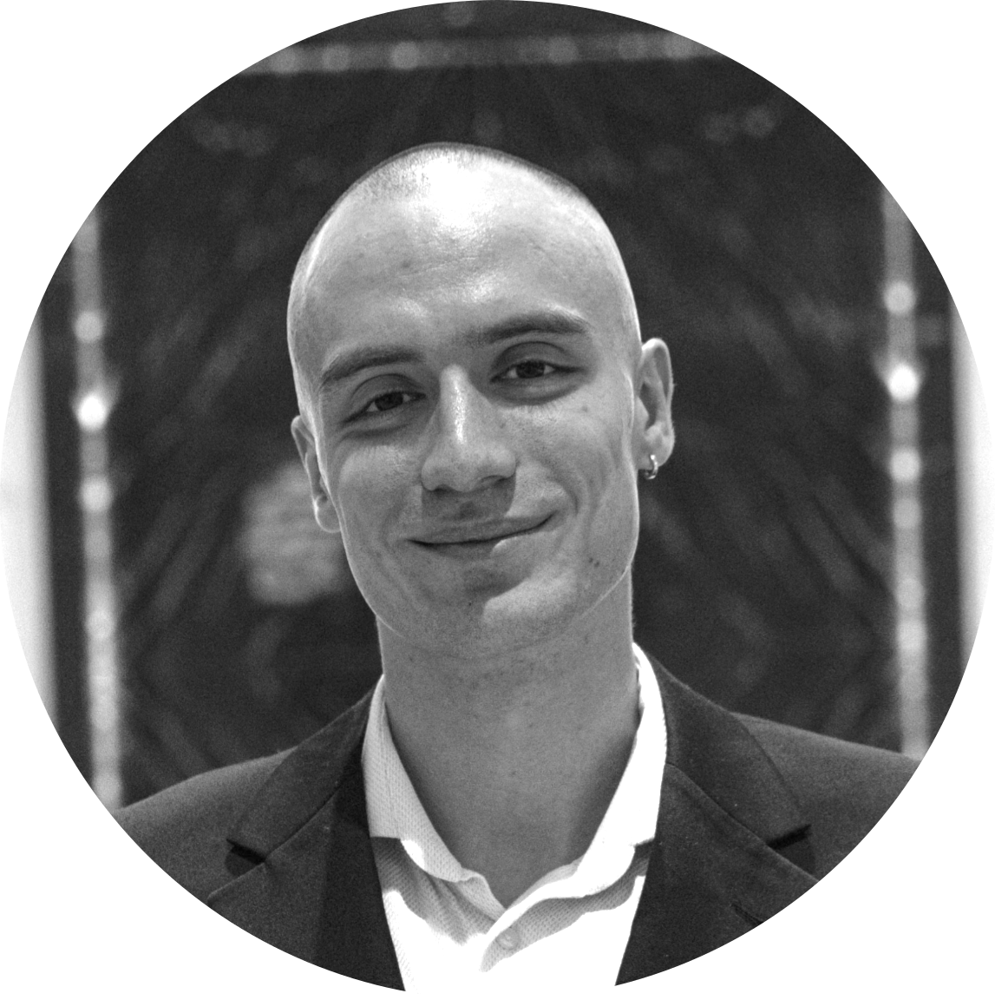
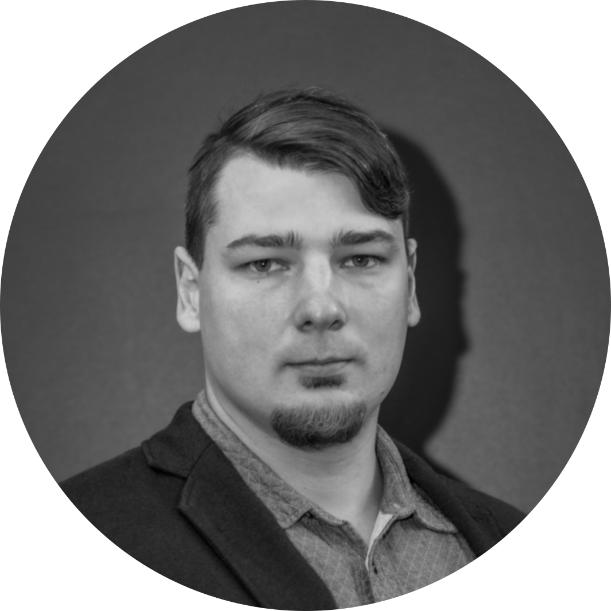

---
hide:
  - navigation
---

{ align=left width=25% }
### Georgiy Malaniya
<!-- 
 <h2>Georgiy Malaniya</h2> 
 -->
Georgiy Malaniya received a specialist degree from the Faculty of Mechanics and Mathematics of Moscow State University in 2021. His research mainly focuses on control theory and machine learning. Georgiy has industrial experience in R&D at Huawei Tech as a research engineer in the field of machine learning from 2019 to 2021, developing time series models based on Bayesian methods. In 2021, Georgy was given a postgraduate position in the Artificial Intelligence in Dynamic Action laboratory at Skoltech. Georgiy's main area of research is reinforcement learning with safety guarantees.

{ align=left width=25% }
<!-- 
 <h2>Anton Bolychev</h2> 
 -->
### Anton Bolychev

Anton Bolychev received a diploma with honors from Moscow State University in 2020. In the industrial sector, Anton contributed to quantitative research at VTB Capital by developing the infrastructure for pricing financial instruments and conducted machine and deep learning research at Kamaz. From 2022 he is a PhD student and an employee of AIDA lab at Skoltech. He is dedicated to exploring practical applications within the domains of RL and optimal control.

{ align=left width=25% }
### Grigoriy Yaremenko
Grigory Yaremenko graduated from the CMC MSU in 2020, defending his diploma at the Department of Nonlinear Dynamic Systems and Control Processes (NDSiPU). From 2019 to 2020, Grigory developed data-driven leak detection for NPA Vira Realtime LLC. In 2021, he worked on GAN-based video synthesis at Samsung AI center. In 2022, he got his MSc in Data Science at Skoltech. From 2022 he is a PhD student and an employee of AIDA lab. He conducts formal research in Lyapunov theory and experimental research in RL and stabilization.

{ align=left width=25% }
### Pavel Osinenko
Pavel Osinenko received a diploma with honors from Bauman Moscow State Technical University in 2009, and a PhD degree from Dresden University of Technology in 2014.
From 2011 through 2020, Pavel worked in German academic and industrial sectors as a principal engineer and researcher.
Since 2020, Pavel has been an assistant professor at Skoltech, Moscow.
His profile is focused on RL, nonlinear control and computational aspects of dynamical systems.
<!-- <figure markdown>
  { width=300 }
  <figcaption>Image caption</figcaption>
</figure> -->
