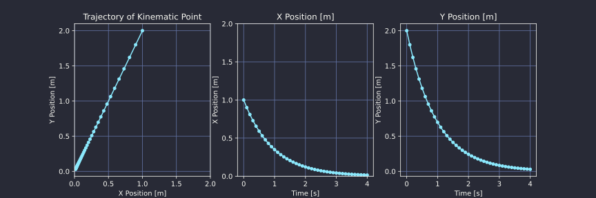

## Regelum Framework Tutorial: Implementing and Simulating a Kinematic Point System

This tutorial will walk you through the process of implementing a simple kinematic point system within the Regelum framework, defining a basic stabilizing control action, instantiating a CasADi simulator, running a simulation loop, and finally plotting the trajectory of the system using matplotlib.


### Kinematic Point System (todo add link) 

A kinematic point is a basic model that represents the motion of a point mass in a 2D space influenced by velocity inputs. In this system, the state typically comprises the point's position coordinates, while the inputs control the point's velocity along respective axes.

$$  
    \diff \state = \diff \left(
    \begin{array}{c}
        x \\
        y
    \end{array}
    \right) = \left(
    \begin{array}{c}
        v_x \\
        v_y
    \end{array}
    \right) \diff t
$$


Here's a brief description of the attributes within the Kinematic Point System implemented in Regelum:

- `_name`: Identifier name for the system.
- `_system_type`: Marks the system as a differential equation (`"diff_eqn"`).
- `_dim_state`: Dimension of the state, `2` for 2D space (x, y coordinates).
- `_dim_inputs`: Dimension of the inputs, `2` for velocity controls along each axis (v_x, v_y).
- `_dim_observation`: Dimension of the observation, which is the same as the state dimension in this simple case.
- `_observation_naming` & `_state_naming`: Names for state dimensions for better interpretability.
- `_inputs_naming`: Names for input dimensions.
- `_action_bounds`: Defines the bounds for each action (velocity input) dimension to enforce feasible velocity ranges.

### Implementing Kinematic Point System

Here's an example of how a kinematic point system can be defined:
``` python
from regelum.system import System
import numpy as np

class KinematicPoint(System):
    _name = "kinematic-point"
    _system_type = "diff_eqn"
    _dim_state = 2
    _dim_inputs = 2
    _dim_observation = 2
    _observation_naming = _state_naming = ["x", "y"]
    _inputs_naming = ["v_x", "v_y"]
    _action_bounds = [[-10.0, 10.0], [-10.0, 10.0]]

    def _compute_state_dynamics(self, time, state, inputs):
        return inputs  # The velocity inputs directly define the rate of change of position.
```

### Stabilizing Action Function

To achieve stabilization of the kinematic point, i.e. tending to zero for both $x$ and $y$, we'll define a function `get_action()` that produces control inputs designed to drive the system's state (position) towards the origin (i.e., achieving stabilization). This is a simple negative feedback control law.

``` python
def get_action(state):
    return -state  # Stabilizing action: control input is the negative of the system state.
```

Indeed, the control inputs defined by

$$
    \left(
    \begin{array}{c}
        v_x \\
        v_y
    \end{array}
    \right) = - \left(    \begin{array}{c}
        x \\
        y
    \end{array}\right)
$$

lead to dynamics that inherently drive the system back to the origin:

$$
    \diff x = - x \diff t \Longleftrightarrow x(t) = x(0) \exp(-t) \ra 0, \text{ as } t \ra \infty
$$

and $y(t) \ra 0$ by the similar reasons.

### Instantiating CasADi Simulator

A `Simulator` in Regelum integrates the RHS of a system, providing iterative steps for the simulation. [CasADi](https://web.casadi.org/) is the primary backend for simulation. The simulator is an integral component that takes the model of the system's dynamics and approximates its behavior over time.

Next, we'll instantiate a CasADi simulator, providing the kinematic point system and the initial conditions.

Simulator 

``` python
from regelum.simulator import CasADi

# Define the initial state (initial position of the kinematic point).
initial_state = np.array([[2.0], [2.0]])  # Start at position (2, 2)

# Initialize the kinematic point system.
kinematic_point = KinematicPoint()

# Instantiate a simulator for the kinematic point system.
simulator = CasADi(system=kinematic_point, state_init=initial_state, time_final=4, max_step=0.1)
```

### Running the Simulation Loop

With the simulator ready, we can now run the simulation loop, applying the stabilizing action at each step and recording the system state history.
``` python
state_history = [initial_state.flatten()]  # Store the initial state.
times = [0.0]

for _ in range(int(simulator.time_final / simulator.max_step)):
    action = get_action(simulator.state)  # Compute the action based on the current state.
    simulator.receive_action(action)  # Provide the action to the simulator.
    simulator.do_sim_step()  # Perform one simulation step.
    state_history.append(simulator.state.flatten())  # Store the state after the step.
    times.append(simulator.time)

state_history = np.array(state_history)  # Convert history to numpy array for plotting.
times = np.array(times)  # Convert history to numpy array for plotting.
```

### Plotting the Trajectory

Finally, we can visualize the trajectory of the kinematic point with matplotlib.

``` python
import matplotlib.pyplot as plt

fig, (ax_traj, ax_x, ax_y) = plt.subplots(1, 3, figsize=(12, 4))
ax_traj.plot(state_history[:, 0], state_history[:, 1], marker='o', markersize=4)
ax_traj.set_title('Trajectory of Kinematic Point')
ax_traj.set_xlabel('X Position [m]')
ax_traj.set_xlim(0, 2)
ax_traj.set_xticks(np.linspace(0, 2, 5))
ax_traj.set_yticks(np.linspace(0, 2, 5))
ax_traj.set_ylabel('Y Position [m]')
ax_traj.grid(True)

ax_x.plot(times, state_history[:, 0], marker='o', markersize=4)
ax_x.set_ylim(0, 2)
ax_x.set_yticks(np.linspace(0, 2, 5))
ax_x.set_title('X Position [m]')
ax_x.set_xlabel('Time [s]')
ax_x.set_ylabel('X Position [m]')
ax_x.grid(True)

ax_y.plot(times, state_history[:, 1], marker='o', markersize=4)
ax_y.set_yticks(np.linspace(0, 2, 5))
ax_y.set_title('Y Position [m]')
ax_y.set_xlabel('Time [s]')
ax_y.set_ylabel('Y Position [m]')
ax_y.grid(True)
```

<figure markdown="span">
  { width="900" }
  <!-- <figcaption>Image caption</figcaption> -->
</figure>