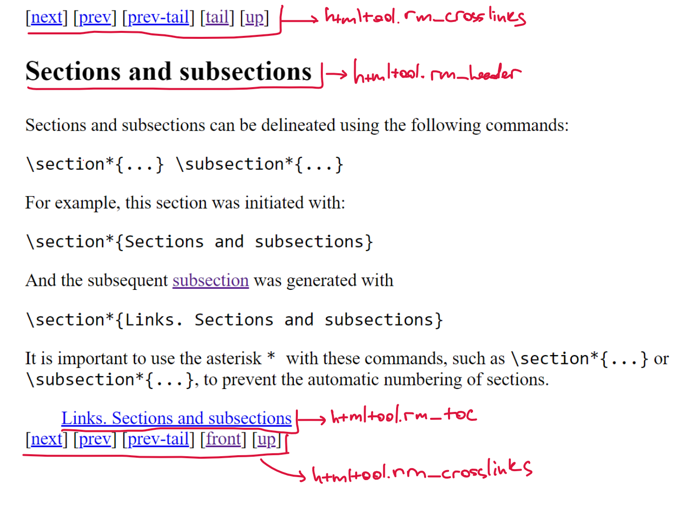
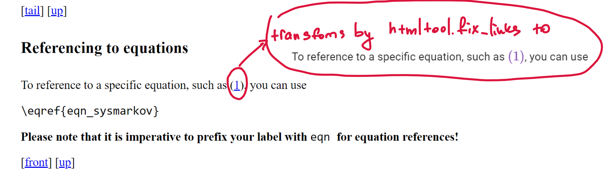

# Overview 

This directory is designated for LaTeX standalone files intended to be incorporated into the main documentation. When you have a `.tex` file, it can be seamlessly integrated, ensuring all equations, hyperlinks, bibliographies, and tables are properly rendered within the main document. It is important to adhere to specific guidelines to achieve a polished and professional-looking documentation page.

## Usage Instructions

To incorporate a new standalone LaTeX page into the documentation:

### Step 1: Create a New Directory

First, establish a new directory within the src/ folder by executing the following commands:

```bash
mkdir -p src/newpage
cp src/_template/template.tex src/newpage/newpage.tex
```

> Important Note: It's essential to choose distinctive and descriptive names for .tex files to avoid conflicts. Refrain from using generic names like main.tex. For example, if you have:
>
> - src/dir1/main.tex
> - src/dir2/main.tex
>
> This will cause build files to overlap and potentially lead to unpredictable issues. Prioritize thoughtful naming.

### Step 2: Use Docker for Building

Given the complexity of local LaTeX build configurations, we utilize Docker for the build process. To create the Docker image, run:

```
docker build -t make4ht
```

This build may take between 10 to 20 minutes to complete.

> Note: For Docker installation instructions, refer to the official [Docker documentation](https://docs.docker.com/get-docker/).

### Step 3: Generate HTML Files

Execute the following command to build HTML files suitable for insertion into a Markdown document:

```bash
docker run -v $(pwd):/work make4ht src/newpage
```

This will generate two folders: `src/newpage/build/` and `src/newpage/mdhtml/`. Your target should be the `src/newpage/mdhtml/` directory, where the `src/newpage/mdhtml/newpage.md` file will be located. Place this file into the desired location within the `../src/` directory to view your LaTeX-rendered page on the documentation site.

An in-depth explanation of the processes that are triggered via
```bash
docker run -v $(pwd):/work make4ht src/newpage
```
is provided [below](#how-the-build-process-works).

### Step 4: Access the Comprehensive Guide for Crafting Your First Document

For detailed instructions on how to structure your LaTeX document to ensure it renders correctly on the MkDocs website, please consult the comprehensive guide available at:

[guide.pdf](./guide.pdf)

## How the Build Process Works

The command:

```
docker run -v $(pwd):/work make4ht src/newpage
```

executes several steps to convert LaTeX files to HTML:

1. Compiles your `src/newpage/newpage.tex` file with pdflatex.
2. Generates the bibliography.
3. Runs the LaTeX file compilation twice more (LaTeX requires this for proper referencing).
4. Converts your `.tex` file into HTML pages (one per section/subsection) using [make4ht](https://texdoc.org/serve/make4ht/0), a tool for creating HTML documents from LaTeX files. The need for Docker arises primarily due to the complexities associated with make4ht.

The output from these commands is saved to the `src/newpage/build/ directory`. Subsequently, our [`htmltool.py`](./htmltool.py) script processes the HTML files to ensure they are primed for Markdown integration and saves the results to the `src/newpage/mdhtml/` directory. Please, see [this section](#htmltoolpy) for details.

###  [`htmltool.py`](./htmltool.py)

The  [`htmltool.py`](./htmltool.py) script serves as a crucial component in the post-processing phase. It handles multiple HTML pages generated by make4ht, preparing them for inclusion in the documentation. The script also constructs a markdown file featuring markdown headings and directives in the form of `--8<-- path/to/html/page.html`, which seamlessly integrate specific HTML content into designated locations within the document:

```markdown
## Introduction
--8<-- "newpage/newpageli1.html"

## Structure
--8<-- "newpage/newpageli2.html"

## Sections and subsections
--8<-- "newpage/newpageli3.html"

### Links. Sections and subsections
--8<-- "newpage/newpageli4.html"

...
```
For a deeper understanding of the `--8<--` directive's functionality, refer to this [GitHub comment](https://github.com/squidfunk/mkdocs-material/discussions/3573) and the [Snippets markdown extension](https://facelessuser.github.io/pymdown-extensions/extensions/snippets/).


We provide here the demonstration of what [`htmltool.py`](./htmltool.py) does. In particular, it removes elements like redundant headings, which will be replaced by Markdown headings, and extraneous tables of contents and crosslinks. The specific methods responsible for these tasks are:
- rm_crosslinks: Extracts unnecessary cross-references.
- rm_heading: Deletes headings that will be substituted by Markdown formatting.
- rm_toc: Removes any auto-generated tables of contents that are not required.
Below we provide the raw how the raw html page looks like: 

Furthermore, a demonstration of how `htmltool.py` handles the processing of equation links is provided:

For a comprehensive explanation of other functions, please consult the docstrings provided in the htmltool.py script.